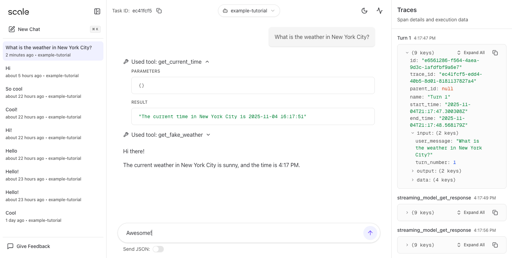
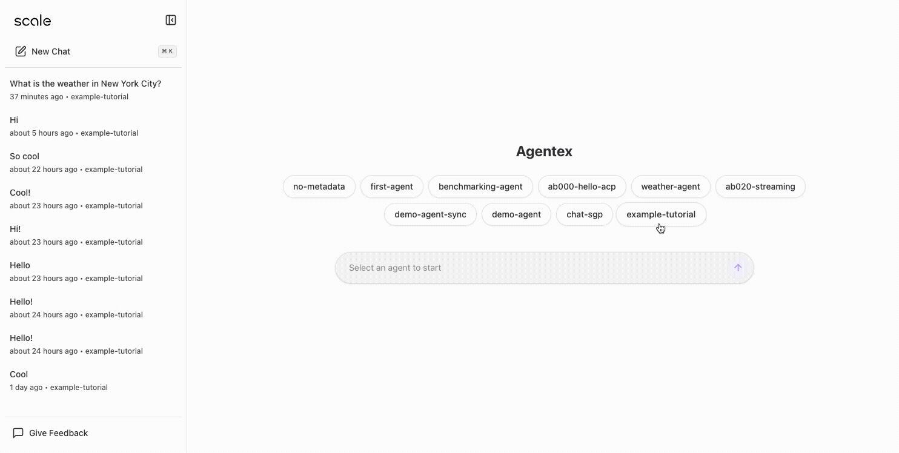
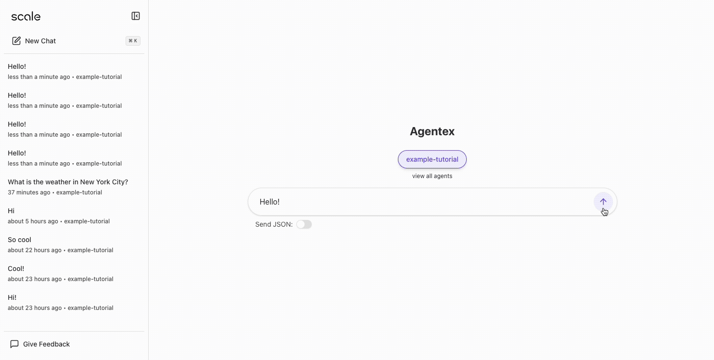
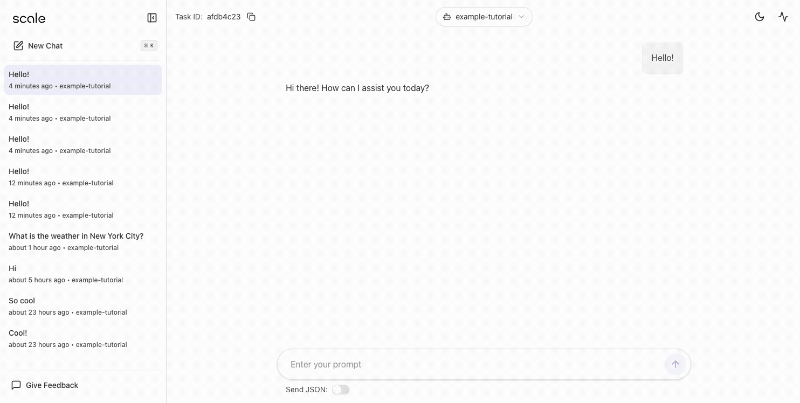
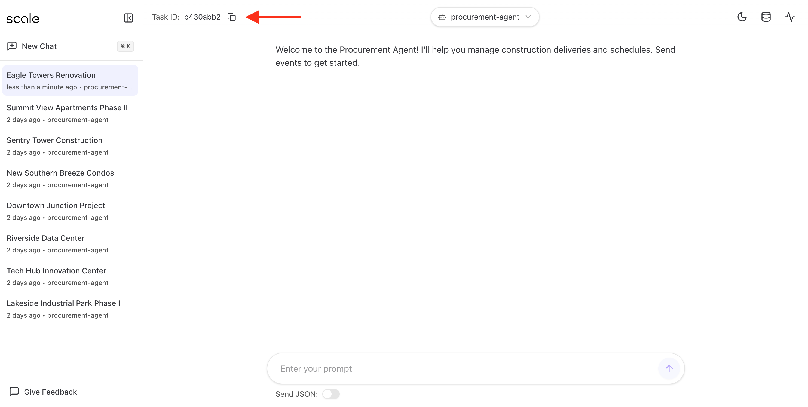

# Agentex UI

A modern web interface for building, testing, and monitoring intelligent agents. The Agentex UI provides a comprehensive developer experience for interacting with agents, managing tasks, and visualizing execution traces.



## Features

### Agent Management

- **Agent Discovery** - Browse and explore all available agents in your system
- **Agent Details** - View agent configurations, capabilities, and deployment status
- **Multi-Agent Support** - Work with multiple agents simultaneously



### Task Execution

- **Create Tasks** - Initialize agent tasks with custom parameters
- **Task History** - View complete task execution history with filtering by agent
- **Infinite Scroll** - Efficiently browse through long task lists


### Interactive Chat

- **Conversational Interface** - Send messages and interact with agents in real-time
- **Streaming Responses** - Live message streaming for sync agents
- **Message History** - Full conversation history with timestamps
- **Rich Content Support** - Display text, markdown, code, and structured data



### Observability

- **Execution Traces** - View OpenTelemetry-style spans for task execution
- **Span Visualization** - Hierarchical view of execution flow
- **Performance Metrics** - Timing and duration information for each execution step
- **Error Tracking** - Detailed error information when tasks fail



### Developer Experience

- **Real-time Updates** - Live task and message updates via WebSocket subscriptions
- **Optimistic UI** - Instant feedback with automatic cache updates
- **Error Handling** - User-friendly error messages with toast notifications
- **Dark Mode** - WCAG-compliant dark mode with proper contrast ratios

## Extended Features

This UI includes several enhancements beyond the standard Agentex capabilities:

### Artifact Panel

An interactive side panel for viewing rich content generated by agents:

- **PDF Viewer** - In-app PDF document viewing with navigation controls
- **Map Viewer** - Interactive Google Maps integration for location-based data
- **Data Tables** - Native database query results displayed in sortable tables
- **Split View** - Resizable panel that allows simultaneous viewing of artifacts and chat

The artifact panel automatically detects and displays procurement events, documents, and location data from agent responses.

### Task Creation Without Messages

Start agent tasks using structured parameters instead of requiring an initial message:

- **Project Form Interface** - Create construction project tasks with dedicated input fields
- **Direct Parameter Passing** - Pass structured data directly to agent initialization
- **No Chat Required** - Begin tasks without sending an initial message
- **Flexible Params** - Support for any agent-specific parameters via the params object

### Human-in-the-Loop Support

Interactive agent workflows that pause for human input, decisions, or approvals:

- **wait_for_human Tool Detection** - Automatically detects when agents request human input
- **Inline Response Forms** - Displays contextual forms directly in the message stream
- **Recommended Actions** - Shows agent's suggested actions or questions to guide responses
- **Optimistic UI** - Instant feedback when submitting responses
- **Keyboard Shortcuts** - Submit responses with Cmd/Ctrl + Enter
- **Response State Tracking** - Clearly indicates when responses have been received

When an agent calls the `wait_for_human` tool with a `recommended_action` parameter, the UI automatically renders an interactive form allowing the user to provide input. Once submitted, the response is sent back to the agent to continue execution.

### Native Data API

A Next.js API route for querying external databases directly from the UI:

- **SQLite Integration** - Query SQLite databases via `app/api/data/[taskId]/route.ts`
- **Custom Tables** - Access agent-specific data tables (schedules, procurement items, etc.)
- **Type-Safe** - Fully typed responses with TypeScript interfaces
- **Performance** - Direct database access without backend roundtrips

This enables agents to maintain their own data stores that the UI can query independently of the main Agentex API.

## Demo: Procurement Agent

To see these features in action, try the procurement agent demo from the Scale Agentex Python SDK:

 

### Setup Instructions

1. **Clone the SDK repository:**

   ```bash
   git clone https://github.com/scaleapi/scale-agentex-python.git
   cd scale-agentex-python
   ```

2. **Navigate to the procurement agent:**

   ```bash
   cd examples/demos/procurement_agent
   ```

3. **Run the agent:**

   ```bash
   # Install dependencies
   uv sync

   # Run the agent
   export ENVIRONMENT=development && uv run agentex agents run --manifest manifest.yaml
   ```

4. **Configure the UI:**

   In your `agentex-ui/.env.development`:

   ```bash
   NEXT_PUBLIC_GOOGLE_MAPS_API_KEY=your_google_maps_api_key
   NEXT_PUBLIC_SQLITE_DB_PATH=/path/to/procurement_agent/construction_project.db
   ```

5. **Start a project:**

   Open the UI, select the procurement agent, and create a new construction project. The agent will:
   - Track procurement items and their status
   - Display interactive maps of delivery locations
   - Show project schedules in data tables
   - Render submitted documents in the PDF viewer

6. **Copy the task id**

   Copy the task id in the top left of the UI

   

7. **Send Test Events**

   From this directory (`scale-agentex-python/examples/demos/procurement_agent`):

   ```bash
   # Navigate to the scripts directory
   cd project/scripts

   # Send events (you'll be prompted for the task ID)
   uv run send_test_events.py
   ```

**Learn More:** [Agentex Procurement Agent](https://github.com/scaleapi/scale-agentex-python/tree/main/examples/demos/procurement_agent)

### Using Human-in-the-Loop in Your Agents

To request human input in your agent code, use the `wait_for_human` tool:

```python
# In your agent's tool definitions
from agentex import tool

@tool
def wait_for_human(recommended_action: str) -> str:
    """
    Pause execution and wait for human input.

    Args:
        recommended_action: A message or question to display to the user

    Returns:
        The user's response text
    """
    pass  # Implementation handled by Agentex framework

# Example usage in agent logic
response = wait_for_human(
    recommended_action="Should we proceed with ordering 500 units of steel beams at $50,000?"
)

if "yes" in response.lower() or "approve" in response.lower():
    # Continue with the order
    place_order(item="steel beams", quantity=500)
else:
    # Cancel or adjust the order
    cancel_order()
```

The UI will automatically:

1. Detect the `wait_for_human` tool call
2. Render an interactive form with the `recommended_action` message
3. Wait for the user to submit their response
4. Send the response back to the agent to continue execution

## Stack

- **Framework**: Next.js 15 (App Router), React 19, TypeScript
- **Styling**: Tailwind CSS v4, shadcn/ui components
- **State Management**: React Query for server state
- **Data Fetching**: Agentex SDK (`agentex`) for API client + RPC helpers
- **Real-time**: WebSocket subscriptions for live updates

## Prerequisites

- npm
- Running Agentex backend (see `../agentex/README.md`)

## Getting Started from Scratch

### 1. Start the Backend

Before running the frontend, ensure the Agentex backend is running:

```bash
cd ../agentex
make dev
```

This starts all required services (PostgreSQL, Redis, MongoDB, Temporal) and the FastAPI backend on port 5003.

### 2. Configure Environment Variables

Create your local environment file:

```bash
cd agentex-ui
cp example.env.development .env.development
```

Edit `.env.development` with your configuration:

```bash
# Required: Backend API endpoint
NEXT_PUBLIC_AGENTEX_API_BASE_URL=http://localhost:5003

# Optional: Google Maps API key for map visualization features
NEXT_PUBLIC_GOOGLE_MAPS_API_KEY=your_google_maps_api_key_here

# Optional: SQLite database path for native data API (used by procurement agent)
NEXT_PUBLIC_SQLITE_DB_PATH=/path/to/your/database.db
```

**Environment Variable Details:**

| Variable                           | Required | Description                                                                |
| ---------------------------------- | -------- | -------------------------------------------------------------------------- |
| `NEXT_PUBLIC_AGENTEX_API_BASE_URL` | Yes      | Base URL for the Agentex backend API (default: `http://localhost:5003`)    |
| `NEXT_PUBLIC_GOOGLE_MAPS_API_KEY`  | No       | Google Maps API key for rendering map visualizations in the artifact panel |
| `NEXT_PUBLIC_SQLITE_DB_PATH`       | No       | Path to SQLite database for native data queries (used by procurement demo) |

### 3. Install Dependencies

```bash
npm install
```

This installs all required packages including Next.js, React, Tailwind CSS, and the Agentex SDK.

### 4. Run the Development Server

```bash
npm run dev
# or using make
make dev
```

The application will start on [http://localhost:3000](http://localhost:3000).

## Scripts

**Development:**

- `make dev` or `npm run dev` — Start dev server with Turbopack
- `npm run build` — Create production build
- `npm start` — Start production server

**Code Quality:**

- `make lint` or `npm run lint` — Run ESLint with zero warnings policy
- `npm run lint:fix` — Auto-fix linting issues
- `make typecheck` or `npm run typecheck` — TypeScript type checking
- `npm run format` — Format code with Prettier
- `npm run format:check` — Check formatting without writing

**Testing:**

- `npm test` — Run tests in watch mode
- `npm run test:run` — Run tests once (CI mode)
- `npm run test:ui` — Open Vitest UI for interactive testing
- `npm run test:coverage` — Generate coverage report

## Architecture

### Code Structure

**Entry Point:**

- `app/page.tsx` → Main application entry → `app/home-view.tsx`

**State Management:**

- `hooks/use-agents.ts` - Fetches all agents via React Query
- `hooks/use-tasks.ts` - Task list with infinite scroll pagination
- `hooks/use-task-messages.ts` - Message fetching and sending with message streaming for sync agents
- `hooks/use-task-subscription.ts` - Real-time task updates via WebSocket for async agents
- `hooks/use-spans.ts` - Execution trace data

**Components:**

- `components/agentex/*` - Agentex-specific UI components (chat, task list, etc.)
- `components/ui/*` - Reusable UI primitives from shadcn/ui

## Testing

The project uses [Vitest](https://vitest.dev/) as the test runner with React Testing Library for component testing.

### Running Tests

```bash
# Watch mode (runs tests on file changes)
npm test

# Run once (useful for CI)
npm run test:run

# Interactive UI
npm run test:ui

# Generate coverage report
npm run test:coverage
```

### Test Configuration

The test suite is configured with:

- **Environment**: happy-dom (lightweight DOM simulation)
- **Globals**: Enabled for describe/it/expect without imports
- **Coverage**: v8 provider with text, JSON, and HTML reporters
- **Setup**: Path aliases configured to match Next.js (@/ → root, @/app, @/components, @/lib)

Coverage reports are generated in the `coverage/` directory and exclude config files, type definitions, and node_modules.

### Writing Tests

- Use Testing Library best practices for component tests
- Test files should be co-located with the code they test (e.g., `lib/utils.ts` → `lib/utils.test.ts`)
- Aim for high coverage on business logic and utility functions
