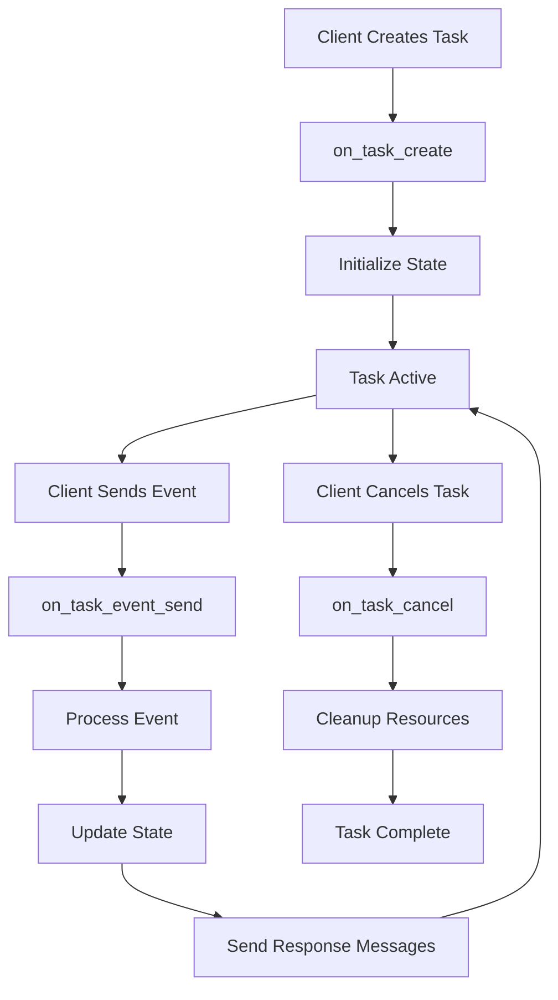

# Agentic ACP

**Agentic ACP** is the powerful, event-driven approach for complex agent interactions. It provides complete control over task lifecycle, state management, and workflows through three distinct handlers.

## What is Agentic ACP?

Agentic ACP provides full lifecycle control where:

- You implement **three handler methods** for complete lifecycle management
- Tasks require **explicit initialization** and cleanup
- Messages flow through **event-driven architecture**
- **State management** is essential for workflow coordination

## Two Implementation Approaches

Agentic ACP can be implemented in two ways:

| Aspect | Base Agentic ACP | Temporal Agentic ACP |
|--------|------------------|----------------------|
| **Best for** | Learning, development, POCs | Production, enterprise |
| **State Management** | Agentex state APIs | Temporal event sourcing or Agentex state |
| **Durability** | Basic | Enterprise-grade |
| **Fault Tolerance** | Manual error handling | Automatic recovery |
| **Scalability** | Development scale | Millions of workflows |
| **Complexity** | Lower | Higher initial setup |

## Core Architecture

Both Base and Temporal Agentic ACP share the same three-handler pattern:

```python
@acp.on_task_create
async def handle_task_create(params: CreateTaskParams):
    """Initialize new tasks - setup state, send welcome messages"""
    pass

@acp.on_task_event_send
async def handle_event_send(params: SendEventParams):
    """Process events during task lifetime - core business logic"""
    pass

@acp.on_task_cancel
async def handle_task_cancel(params: CancelTaskParams):
    """Clean up when tasks end - archive data, release resources"""
    pass
```

## Task Lifecycle



## Asynchronous Event Processing

Think of Agentic ACP like a **postal system for agents** - each agent has its own mailbox where events are delivered asynchronously, and agents decide when and how to process their mail.

### Every Agent Has a Mailbox

Each agent has a **mailbox** where events are delivered and queued:

- Events arrive from other agents, external clients, scheduled tasks, or webhooks
- Events pile up whether the agent is ready or not
- Agents decide when to process accumulated events

### Flexible Processing Patterns

```python
# Option 1: Process one event at a time
@acp.on_task_event_send
async def process_single_event(params: SendEventParams):
    if params.event.content:
        response = await handle_single_event(params.event.content)
        # Process and respond right away

# Option 2: Batch process accumulated events
@acp.on_task_event_send
async def batch_process_events(params: SendEventParams):
    # Add current event to pending batch
    # ... accumulate events ...

    if batch_is_full:
        results = await process_batch(accumulated_events)

# Option 3: Smart processing based on content
@acp.on_task_event_send
async def smart_process(params: SendEventParams):
    if is_urgent_event(params.event):
        await process_immediately(params.event)
    else:
        await add_to_processing_queue(params.event)
```

### Event Cursor: Tracking Progress

Use Agent Task Tracker as a cursor system to track which events have been processed:

```python
@acp.on_task_event_send
async def handle_event_send(params: SendEventParams):
    # Get current processing cursor
    tracker = await adk.agent_task_tracker.get_by_task_and_agent(
        task_id=params.task.id,
        agent_id=params.agent.id
    )

    # Get all unprocessed events since last cursor
    unprocessed_events = await adk.events.list_events(
        task_id=params.task.id,
        agent_id=params.agent.id,
        last_processed_event_id=tracker.last_processed_event_id,
        limit=50
    )

    if not unprocessed_events:
        return

    # Process batch
    for event in unprocessed_events:
        await process_event(event)

    # Update cursor after all processing is complete
    await adk.agent_task_tracker.update(
        tracker_id=tracker.id,
        request=UpdateAgentTaskTrackerRequest(
            last_processed_event_id=unprocessed_events[-1].id,
            status_reason=f"Processed {len(unprocessed_events)} events"
        )
    )
```

---

## Choose Your Implementation

### Base Agentic ACP

Perfect for learning and development. Use Agentex's built-in state management.

**[→ Read Base Agentic ACP Guide](base.md)**

### Temporal Agentic ACP

Production-ready with durable execution and automatic fault tolerance.

**[→ Read Temporal Agentic ACP Guide](temporal.md)**

---

## Next Steps

- **Getting started?** Learn about [Base Agentic ACP](base.md) first
- **Ready for production?** Explore [Temporal Agentic ACP](temporal.md)
- **Need to upgrade?** Check the [Migration Guide](../../concepts/migration_guide.md)
- **New to Agentex?** Follow the [Quick Start Guide on GitHub](https://github.com/scaleapi/agentex#quick-start)
- **Ready to build?** Check out [Agentic Tutorials on GitHub](https://github.com/scaleapi/agentex-python/tree/main/examples/tutorials/10_agentic)
