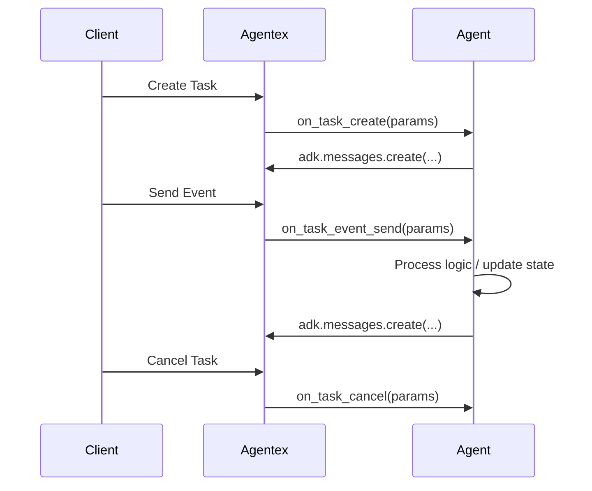

# Base Agentic ACP

**Base Agentic ACP** is the foundational asynchronous model for Agentex. It gives you full control over the task lifecycle with three handlers while Agentex takes care of transport, streaming, and message delivery.

## Core Characteristics

- **Three handler methods**
    - `@acp.on_task_create` – initialize state or send a welcome message
    - `@acp.on_task_event_send` – process each incoming event/message
    - `@acp.on_task_cancel` – cleanup when a task is cancelled
- **Explicit message creation** – create all messages via `adk.messages.create()`
- **Asynchronous and concurrent** – multiple requests can be in-flight; your code should be async-safe
- **State management available** – use `adk.state` when you need persistence across events
- **No durability guarantees** – crashes and retries are your responsibility (see Temporal for durability)

## Message Flow



## Basic Implementation

```python
from agentex.lib.sdk.fastacp.fastacp import FastACP
from agentex.lib.types.fastacp import AgenticACPConfig
from agentex.lib.types.acp import CreateTaskParams, SendEventParams, CancelTaskParams
from agentex.lib import adk

# Create Base Agentic ACP server
acp = FastACP.create(
    acp_type="agentic",
    config=AgenticACPConfig(type="base")
)

@acp.on_task_create
async def handle_task_create(params: CreateTaskParams) -> None:
    # Optionally initialize state, then send a message
    await adk.messages.create(
        task_id=params.task.id,
        agent_id=params.agent.id,
        content="Welcome!"
    )

@acp.on_task_event_send
async def handle_task_event_send(params: SendEventParams) -> None:
    # Process the incoming event and respond
    await adk.messages.create(
        task_id=params.task.id,
        agent_id=params.agent.id,
        content=f"You said: {params.event.content}"
    )

@acp.on_task_cancel
async def handle_task_cancel(params: CancelTaskParams) -> None:
    # Cleanup or finalization logic
    pass
```

## Handler Parameters

### CreateTaskParams

Used in `@acp.on_task_create` for task initialization:

::: agentex.lib.types.acp.CreateTaskParams
    options:
      heading_level: 4
      show_root_heading: false
      show_source: false

### SendEventParams

Used in `@acp.on_task_event_send` for processing events:

::: agentex.lib.types.acp.SendEventParams
    options:
      heading_level: 4
      show_root_heading: false
      show_source: false

### CancelTaskParams

Used in `@acp.on_task_cancel` for cleanup:

::: agentex.lib.types.acp.CancelTaskParams
    options:
      heading_level: 4
      show_root_heading: false
      show_source: false

