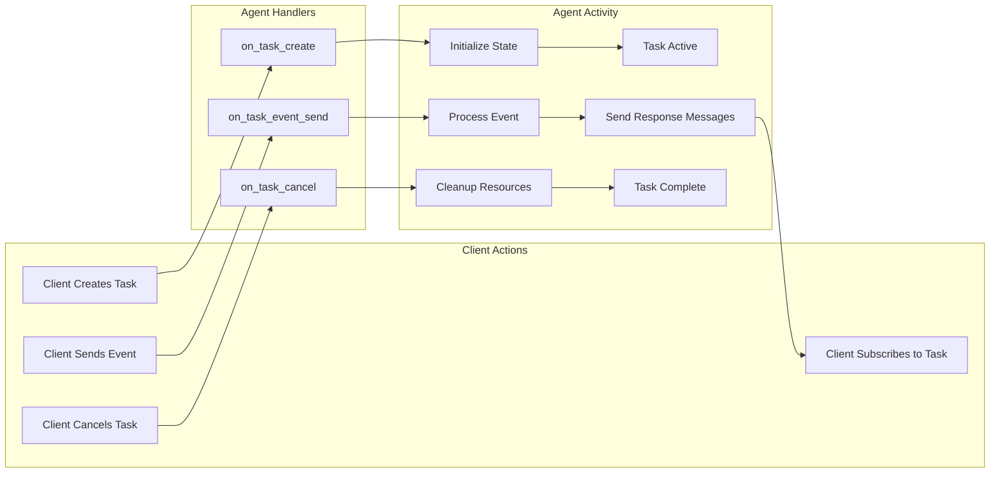

# Async ACP

**Async ACP** is the powerful, event-driven approach for complex agent interactions. It provides complete control over task lifecycle, state management, and workflows through three distinct handlers: [`on_task_create`](https://github.com/scaleapi/scale-agentex-python/blob/main/src/agentex/lib/sdk/fastacp/base/base_acp_server.py#L314), [`on_task_event_send`](https://github.com/scaleapi/scale-agentex-python/blob/main/src/agentex/lib/sdk/fastacp/base/base_acp_server.py#L321), [`on_task_cancel`](https://github.com/scaleapi/scale-agentex-python/blob/main/src/agentex/lib/sdk/fastacp/base/base_acp_server.py#L339).

## Core Architecture

Both Base and Temporal Async ACP share the same three-handler pattern:

```python
@acp.on_task_create
async def handle_task_create(params: CreateTaskParams):
    """Initialize new tasks - setup state, send welcome messages"""
    pass

@acp.on_task_event_send
async def handle_event_send(params: SendEventParams):
    """Process events during task lifetime - core business logic"""
    pass

@acp.on_task_cancel
async def handle_task_cancel(params: CancelTaskParams):
    """Clean up when tasks end - archive data, release resources"""
    pass
```

## Task Lifecycle



## Asynchronous Event Processing

Think of Async ACP like a **postal system for agents** - each agent has its own mailbox where events are delivered asynchronously, and agents decide when and how to process their mail.

### Every Agent Has a Mailbox

Each agent has a **mailbox** where events are delivered and queued:

    - Events arrive from other agents, external clients, scheduled tasks, or webhooks
    - Events pile up whether the agent is ready or not
    - Agents decide when to process accumulated events

### Handling Concurrent Events

Unlike Sync ACP, Async ACP doesn't lock or block past requests. If you expect to receive many concurrent requests, you'll need to handle async events yourself. You can use the Agent Task Tracker with Base ACP or asyncio Queues with Temporal to manage event processing. For more information, see [Events vs Messages](../../concepts/callouts/events_vs_messages.md).
