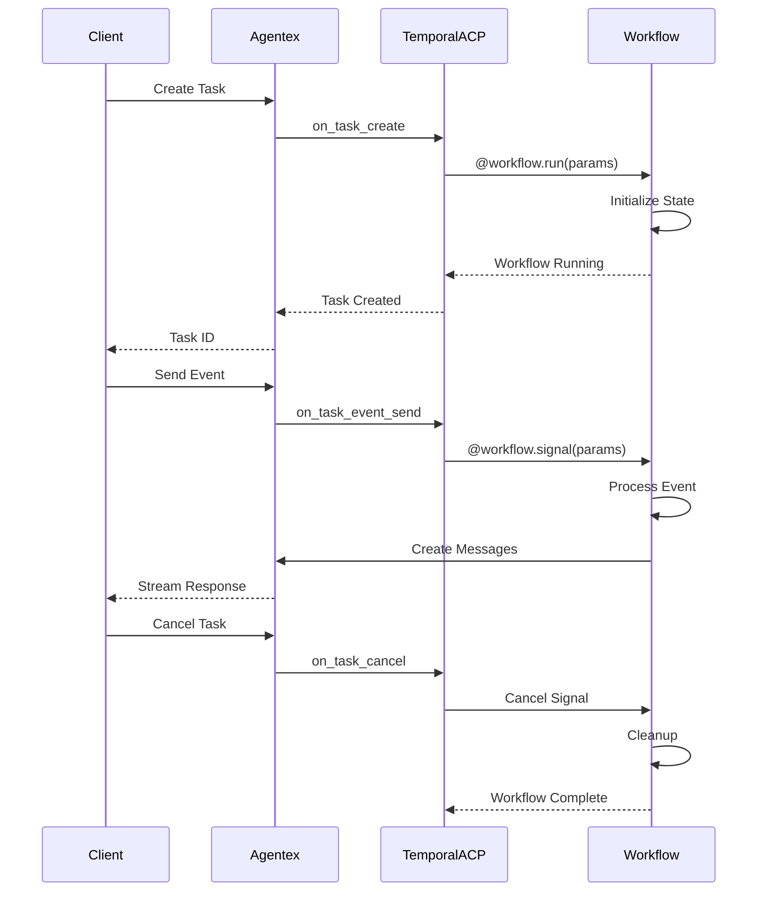

# Temporal Async ACP

**Temporal Async ACP** provides production-ready agent development with **durable execution**, **fault tolerance**, and **automatic state management**. You don't write the ACP handlers yourself - instead, you implement Temporal workflow methods and Agentex automatically handles the ACP mapping for you.

## Core Characteristics

- **No explicit ACP handlers** - You implement workflow methods instead:
    - `@workflow.run` (replaces `@acp.on_task_create`)
    - `@workflow.signal` (replaces `@acp.on_task_event_send`)
    - Task cancellation automatically handled (replaces `@acp.on_task_cancel`)
- **Automatic ACP mapping** - Agentex handles the mapping for you, no manual configuration needed
- **Durable execution** - Workflow state persisted automatically with event history
- **Fault tolerance** - Built-in automatic retries and recovery
- **Production-ready** - Designed for enterprise-grade reliability

## Message Flow



## Basic Implementation

### Workflow Implementation

```python
from temporalio import workflow
from agentex import adk
from agentex.lib.types.acp import CreateTaskParams, SendEventParams
from agentex.core.temporal.workflows.workflow import BaseWorkflow
from agentex.core.temporal.types.workflow import SignalName
from agentex.types.message_author import MessageAuthor
from agentex.types.text_content import TextContent

@workflow.defn(name="my-agent-workflow")
class MyAgentWorkflow(BaseWorkflow):
    def __init__(self):
        super().__init__(display_name="My Agent")
        self._complete_task = False

    @workflow.run
    async def on_task_create(self, params: CreateTaskParams) -> str:
        """
        Replaces @acp.on_task_create - Agentex maps this automatically
        Initialize new tasks - setup state, send welcome messages
        """

        # Send initial message
        await adk.messages.create(
            task_id=params.task.id,
            content=TextContent(
                author=MessageAuthor.AGENT,
                content="Hello! Task created."
            ),
        )

        # Wait for task completion
        await workflow.wait_condition(lambda: self._complete_task)
        return "Task completed"

    @workflow.signal(name=SignalName.RECEIVE_EVENT)
    async def on_task_event_send(self, params: SendEventParams) -> None:
        """
        Replaces @acp.on_task_event_send - Agentex maps this automatically
        Process events during task lifetime - core business logic
        """

        # Process event and send response
        await adk.messages.create(
            task_id=params.task.id,
            content=TextContent(
                author=MessageAuthor.AGENT,
                content=f"You said: {params.event.content.content}"
            ),
        )

    # Note: @acp.on_task_cancel is automatically handled by Agentex and Temporal
    # No implementation needed
```

### ACP Configuration

```python
import os
from agentex.lib.sdk.fastacp.fastacp import FastACP
from agentex.lib.types.fastacp import TemporalACPConfig

# Create the ACP server
acp = FastACP.create(
    acp_type="async",
    config=TemporalACPConfig(
        type="temporal",
        temporal_address=os.getenv("TEMPORAL_ADDRESS", "localhost:7233")
    )
)

# No handlers to register - Agentex automatically maps ACP to your workflow methods:
# @acp.on_task_create → @workflow.run
# @acp.on_task_event_send → @workflow.signal(name=SignalName.RECEIVE_EVENT)
# @acp.on_task_cancel → Automatically handled
```

### Worker Configuration

```python
import asyncio
from agentex.core.temporal.activities import get_all_activities
from agentex.core.temporal.workers.worker import AgentexWorker
from agentex.environment_variables import EnvironmentVariables
from workflow import MyAgentWorkflow

environment_variables = EnvironmentVariables.refresh()

async def main():
    task_queue_name = environment_variables.WORKFLOW_TASK_QUEUE
    if task_queue_name is None:
        raise ValueError("WORKFLOW_TASK_QUEUE is not set")

    worker = AgentexWorker(task_queue=task_queue_name)

    # get_all_activities() returns all temporal activities required for ADK
    await worker.run(
        activities=get_all_activities(),
        workflow=MyAgentWorkflow,
    )

if __name__ == "__main__":
    asyncio.run(main())
```

## Workflow Parameters

### CreateTaskParams

Used in `@workflow.run` (replaces `@acp.on_task_create`):

::: agentex.lib.types.acp.CreateTaskParams
    options:
      heading_level: 4
      show_root_heading: false
      show_source: false

### SendEventParams

Used in `@workflow.signal(name=SignalName.RECEIVE_EVENT)` (replaces `@acp.on_task_event_send`):

::: agentex.lib.types.acp.SendEventParams
    options:
      heading_level: 4
      show_root_heading: false
      show_source: false

