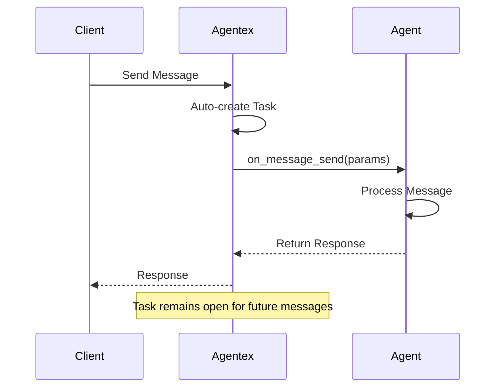

# Sync ACP

**Sync ACP** provides the simplest way to build agents in Agentex. Perfect for blocking request/response interactions (like chat bots) where you don't need complex state management or workflow control.

## Core Characteristics

- **Single handler method**: `@acp.on_message_send`
- **Automatic task lifecycle management** - Tasks created and managed automatically
- **Direct message processing** - Respond to messages immediately
- **Automatic message management** - Agentex Server creates messages on your behalf
- **Minimal complexity** - Focus on your business logic

## Message Flow



## Basic Implementation

```python
from agentex.lib.sdk.fastacp.fastacp import FastACP
from agentex.lib.types.acp import SendMessageParams
from agentex.types.text_content import TextContent
from agentex.types.message_author import MessageAuthor

# Create Sync ACP server
acp = FastACP.create(acp_type="sync")

@acp.on_message_send
async def handle_message(params: SendMessageParams):
    """Process incoming messages and return responses"""

    # Access the user's message
    user_message = params.content.content

    # Process and create response
    response_text = f"You said: {user_message}"

    # Return response (Agentex auto-creates the message)
    return TextContent(
        author=MessageAuthor.AGENT,
        content=response_text
    )
```

## Handler Parameters

### SendMessageParams

The `@acp.on_message_send` handler receives:

::: agentex.lib.types.acp.SendMessageParams
    options:
      heading_level: 4
      show_root_heading: false
      show_source: false
