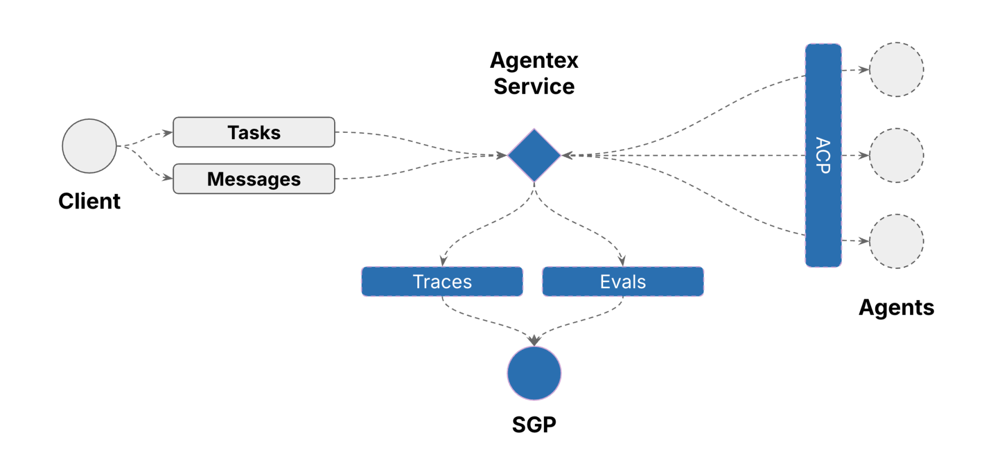

# Agentex Architecture

Understanding how Agentex works will help you make better decisions when building and deploying agents.

## How Agentex Works

**Agents are just code.** Agentex provides "agentic infrastructure" with the flexibility to deploy agents of arbitrarily increasing complexity behind clean abstraction layers. The framework makes it incredibly easy to develop any agent—from simple chatbots to complex autonomous systems.

### Message Flow

1. **Client → Agentex Service**: Clients send Tasks and Messages through a unified API
2. **Agentex Service → Agent Code**: The service routes requests to your agent code via the Agent Control Protocol (ACP)
3. **Agent Code Processing**: Your agent processes the request using any logic, models, or tools you choose
4. **Agent Code → Agentex Service**: Your agent returns responses through the same ACP interface
5. **Agentex Service → Client**: Clients receive streaming responses, regardless of your agent's implementation

### Key Benefits

- **Simple Development**: Focus on your agent's logic, not infrastructure complexity
- **Unified Interface**: All agents expose the same API, making them interchangeable from the client perspective
- **Flexible Deployment**: Deploy anything from simple request-response agents to complex multi-step workflows
- **Production Ready**: Built-in streaming, tracing, evaluation, and scalability features
- **Vendor Agnostic**: Use any AI models, LLM providers, tools, or cloud platforms

## Components

Agentex is comprised of two major components:

| Component | Description |
|-----------|-------------|
| **Agentic Infrastructure** | Handles all the hard parts of running production AI agents—communication, streaming, and scalable deployment—so you can focus on your agent's business logic. |
| **Agentex SDK** | Your toolkit for building agents that leverage the full power of the Agentic Infrastructure, with intuitive APIs for workflows, streaming, and more. |

### Agentic Infrastructure

Agentic Infrastructure lets you focus on your agent's business logic, while it takes care of the hard parts of running production AI agents. It provides:

| Feature | Description |
|---------|-------------|
| **Agent 2 Client Protocol (ACP)** | Manages all communication between clients and agents. All agents adhere to the same abstract API protocol and process the same message schemas. This means you can switch between agents simply by changing the agent name in your client code. |
| **All you need is async** | Agentex agents are designed to be asynchronous. Although simple request/response agents can be built with synchronous code, Agentex is built to support advanced, long-running, and autonomous workflows. |
| **Real-Time Streaming** | Streams results and updates to clients, even for long-running or asynchronous agent work. |
| **Scalable, Isolated Deployments** | Runs each agent as an independently scalable service, so you can scale up or down as needed without affecting other agents. |

### Agentex SDK

The Agentex SDK is your toolkit for building agents that leverage the full power of the Agentic Infrastructure. It provides intuitive APIs and abstractions so you can:

- Implement agent workflows and business logic in Python
- Interact with the Agentex API for task and message handling
- Use built-in support for streaming, distributed work, and tracing
- Focus on your agent's logic, not the plumbing

With the SDK, agent developers can quickly build, test, and deploy robust agents—without reinventing the wheel for infrastructure.

## What Clients Need to Know

To interact with Agentex, clients only need to know three things:

1. **Message Schema:** The schema of the Task or Message to send to the agent. See the [Agentex API docs]({{ extra.hostname }}/api).
2. **Agentex API Gateway Domain:** This is the single entrypoint that will dispatch requests to the correct agent.
3. **Agent Name:** The unique name of the agent to interact with.

## What Agent Developers Need to Know

To respond to client requests, agent developers only need to implement a fixed set of routes defined by the **Agent to Client Protocol (ACP)**. This keeps agent development simple and consistent, regardless of workflow complexity.

**👉 Read [Choose Your Agent Type](../getting_started/choose_your_agent_type.md) to understand your options and choose the right approach for your use case.**

