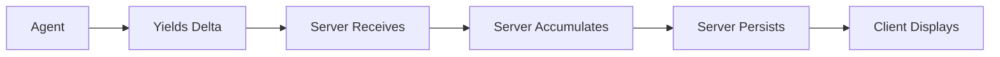
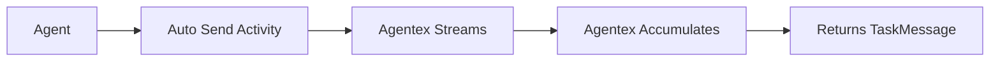
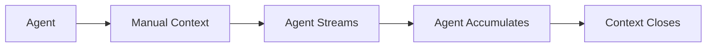

# Streaming & Delta Accumulation

!!! danger "Critical Concept"
    **Different ACP types handle streaming and delta accumulation in fundamentally different ways.** Understanding these differences is essential for proper streaming implementation.

## Core Streaming Patterns

### Sync ACP: Server-Side Delta Accumulation

In **Sync ACP**, delta accumulation happens **server-side** using `AsyncGenerator`. The agent yields deltas, but the **server accumulates and persists** them. You can stream multiple messages, just make sure each has a unique index. The server will automatically accumulate and flush all deltas after the final yield:

```python
# Sync ACP - Return AsyncGenerator, server accumulates deltas
@acp.on_message_send
async def handle_message_send(params: SendMessageParams) -> AsyncGenerator[TaskMessageUpdate, None]:
    # Get conversation history
    task_messages = await adk.messages.list(task_id=params.task.id)
    llm_messages = convert_task_messages_to_llm_messages(task_messages)
    
    message_index = 0
    async for chunk in adk.providers.litellm.chat_completion_stream(
        llm_config=LLMConfig(model="gpt-4o-mini", messages=llm_messages, stream=True),
        trace_id=params.task.id,
    ):
        if chunk.choices and chunk.choices[0].delta.content:
            # YOU yield each delta - SERVER accumulates them
            yield StreamTaskMessageDelta(
                index=message_index,
                delta=TextDelta(text_delta=chunk.choices[0].delta.content)
            )
```

### Async ACP: Three Streaming Options

Becuase Agentic Agents are completely async, they do not yield nor return anything in their ACP handlers. Instead, they should call the appropriate ADK functions to stream updates to the client.

**Pub/Sub Architecture:**
Agentex uses a **pub/sub mechanism** in the server to handle Async ACP streaming. Clients subscribe to **server-side events (SSE)** from Agentex, which allows them to receive streaming publications from agents in real-time. When an agent streams content, it publishes updates through the ADK, and all subscribed clients receive these updates immediately.

The ADK provides two different streaming approaches for agents behind Async ACPs depending on your needs:

## 1. Auto Send (Recommended for Most Cases)

**Agentex handles everything automatically:**

```python
# Async ACP - Auto send handles all delta accumulation
@acp.on_task_event_send
async def handle_event_send(params: SendEventParams):
    # Echo user message
    await adk.messages.create(task_id=params.task.id, content=params.event.content)
    
    # Auto send: Agentex handles all streaming complexity
    task_message = await adk.providers.litellm.chat_completion_stream_auto_send(
        task_id=params.task.id,
        llm_config=LLMConfig(model="gpt-4o-mini", messages=your_messages, stream=True),
        trace_id=params.task.id,
    )
    
    # Returns complete TaskMessage when streaming finishes
    # Agentex automatically:
    # - Creates initial message
    # - Streams deltas to client
    # - Accumulates chunks into final content  
    # - Sends StreamTaskMessageDone
    # - Returns final TaskMessage for your use
    
    return task_message  # Use for state management
```

**Why Auto Send Exists:**

- 🚀 **Temporal compatibility**: Temporal workflows cannot yield generators directly (auto send is the easiest option for Temporal ACP)
- 🔄 **Automatic processing**: Agentex processes streamed chunks automatically
- 📦 **Content type packaging**: Automatically packages as proper TextContent, DataContent, or ToolRequestContent
- ✅ **Simple**: You don't deal with delta accumulation complexity

## 2. Non-Auto Send (Advanced Control)

**You get full control but handle everything manually:**

```python
# Async ACP - Non-auto send: YOU handle everything
@acp.on_task_event_send
async def handle_event_send(params: SendEventParams):
    # YOU must create the streaming context manually
    async with adk.streaming.streaming_task_message_context(
        task_id=params.task.id,
        initial_content=TextContent(author=MessageAuthor.AGENT, content=""),
    ) as streaming_context:
        
        full_response = ""
        async for chunk in adk.providers.litellm.chat_completion_stream(
            llm_config=LLMConfig(model="gpt-4o-mini", messages=your_messages, stream=True),
            trace_id=params.task.id,
        ):
            if chunk.choices[0].delta.content:
                content = chunk.choices[0].delta.content
                full_response += content  # YOU accumulate chunks
                
                # YOU can transform/filter/analyze each chunk
                processed_content = content.upper()  # Example transformation
                
                # YOU must manually send each chunk to client  
                await streaming_context.stream_update(
                    update=StreamTaskMessageDelta(
                        parent_task_message=streaming_context.task_message,
                        delta=TextDelta(text_delta=processed_content),
                    ),
                )
        
        # Context manager automatically sends StreamTaskMessageDone
    
    # YOU manually add to conversation state
    your_conversation_state.append({"role": "assistant", "content": full_response})
```

**When to Use Non-Auto Send:**

- 🔧 **Custom processing**: Transform chunks before sending
- 📊 **Analytics**: Track streaming metrics
- 🎛️ **Multiple destinations**: Send chunks to multiple places
- 🚫 **Not supported directly in Temporal workflows**: You CAN use it if you wrap the streaming logic into a custom Temporal activity to avoid crossing network boundaries

!!! info "Custom Activities for Advanced Streaming"
    If you need custom streaming functionality beyond the basic non-auto send pattern, you'll need to wrap your functionality into **custom activities**. Documentation on creating custom activities is coming soon. For now, reach out to the Agentex maintainers for help with implementing custom streaming solutions.

## Delta Accumulation Flow Comparison

### Sync ACP Flow



1. **Agent yields** individual deltas via `AsyncGenerator`
2. **Server receives** each `StreamTaskMessageDelta` in `agents_acp_use_case`
3. **Server accumulates** deltas using `DeltaAccumulator` per message index
4. **Server persists** complete content on `StreamTaskMessageDone`
5. **Client displays** streaming updates in real-time

### Agentic Auto Send Flow



1. **Agent calls** `chat_completion_stream_auto_send`
2. **Agentex automatically** handles streaming to client
3. **Agentex accumulates** chunks internally
4. **Agent receives** complete `TaskMessage` when done

### Agentic Non-Auto Send Flow



1. **Agent creates** streaming context manually
2. **Agent handles** each chunk individually  
3. **Agent accumulates** and sends deltas
4. **Context manager** automatically finalizes

## Common Patterns & Mistakes

### ❌ Wrong: Using Non-Auto Send Directly in Temporal Workflow

```python
# This will FAIL in Temporal workflows - generators can't cross network boundaries
@workflow.signal(name=SignalName.RECEIVE_EVENT)
async def on_task_event_send(self, params: SendEventParams):
    async for chunk in adk.providers.litellm.chat_completion_stream(...):
        # ERROR: Temporal workflows cannot yield generators directly!
        pass
```

### ✅ Correct: Using Auto Send in Temporal

```python
# This works correctly in Temporal
@workflow.signal(name=SignalName.RECEIVE_EVENT) 
async def on_task_event_send(self, params: SendEventParams):
    task_message = await adk.providers.litellm.chat_completion_stream_auto_send(
        task_id=params.task.id,
        llm_config=LLMConfig(model="gpt-4o-mini", messages=self._state.input_list, stream=True),
        trace_id=params.task.id,
    )
    # Use task_message.content.content for conversation state
```

### ✅ Correct: Sync ACP Auto-Flush

```python
# Sync ACP - Server automatically flushes deltas at end
@acp.on_message_send
async def handle_message_send(params: SendMessageParams) -> AsyncGenerator[TaskMessageUpdate, None]:
    message_index = 0
    async for chunk in adk.providers.litellm.chat_completion_stream(...):
        if chunk.choices[0].delta.content:
            yield StreamTaskMessageDelta(
                index=message_index,
                delta=TextDelta(text_delta=chunk.choices[0].delta.content)
            )
    
    # Optional: yield StreamTaskMessageDone(index=message_index)
    # Server will auto-flush accumulated deltas even without DONE signal
```

## StreamTaskMessageFull Override Technique

You can **override accumulated deltas** by sending `StreamTaskMessageFull` with the same index:

```python
@acp.on_message_send
async def streaming_with_override(params: SendMessageParams) -> AsyncGenerator[TaskMessageUpdate, None]:
    message_index = 0
    
    # Phase 1: Stream initial response
    accumulated_content = ""
    async for chunk in adk.providers.litellm.chat_completion_stream(...):
        if chunk.choices[0].delta.content:
            accumulated_content += chunk.choices[0].delta.content
            yield StreamTaskMessageDelta(
                index=message_index,
                delta=TextDelta(text_delta=chunk.choices[0].delta.content)
            )
    
    # Phase 2: Override with enhanced content (e.g., add citations)
    enhanced_content = f"{accumulated_content}\n\n## Sources\n{generate_citations()}"
    
    # This REPLACES all accumulated deltas for index 0
    yield StreamTaskMessageFull(
        index=message_index,
        content=TextContent(
            author=MessageAuthor.AGENT,
            content=enhanced_content
        )
    )
    
    # After StreamTaskMessageFull, no more deltas can be sent to this index
```

**How Override Works in Server:**

1. **Deltas accumulate**: Server uses `DeltaAccumulator` to collect deltas for each index
2. **StreamTaskMessageFull arrives**: Server immediately creates final message from `content` 
3. **Index marked complete**: Server adds index to `completed_task_message_indexes`
4. **Accumulated deltas ignored**: Any `StreamTaskMessageDone` or remaining deltas for that index are discarded

**Use Cases for Override:**

- 🔄 **Post-processing**: Stream raw content, then enhance with citations/formatting
- 🧠 **Analysis**: Stream thinking process, then replace with final conclusion  
- 🛠️ **Tool integration**: Stream partial results, then override with tool-enhanced content

## When to Use Each Pattern

### Use Sync ACP Streaming When:

- ✅ Simple request-response patterns
- ✅ Full control over each delta needed
- ✅ Prototyping or development
- ✅ Custom client-side accumulation logic

### Use Agentic Auto Send When:

- ✅ **Production systems** (especially Temporal)
- ✅ **Standard streaming** without custom processing  
- ✅ **Temporal workflows** (only option)
- ✅ **Simplified development** - let Agentex handle complexity

### Use Agentic Non-Auto Send When:

- ✅ **Custom chunk processing** before sending to client
- ✅ **Analytics or monitoring** of streaming chunks
- ✅ **Multiple streaming destinations**
- ❌ **NOT directly in Temporal workflows** (wrap in custom activity or use auto send instead)

## Key Takeaway

!!! info "Choose the Right Pattern"
    
    - **Sync ACP**: Manual delta accumulation, full control
    - **Agentic Auto Send**: Automatic everything, works everywhere (easiest option for Temporal)  
    - **Agentic Non-Auto Send**: Manual control for advanced use cases (requires custom Temporal activity wrapper)


 