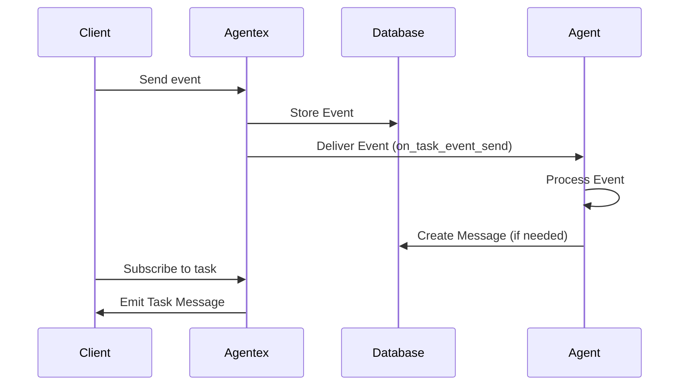

# Event Concepts

Events are notifications that trigger agent processing in Async Agents. They're fundamentally different from messages and only exist in the async world.

## What is an Event?

An **Event** is a notification that something happened - a user sent a message, a webhook fired, a scheduled task triggered. Events tell your agent "there's work to do" without prescribing what message (if any) should be saved to conversation history.

Think of events like email notifications: they alert you that something happened, but you decide whether to archive them, reply, or ignore them.

!!! note "Async Agents Only"
    Events only exist for [Async Agents](../agent_types/async/overview.md). [Sync Agents](../agent_types/sync.md) don't use events - they work directly with messages that are automatically persisted.

## Why Events Are Separate from Messages

**Events are ephemeral notifications. Messages are persistent conversation history.**

This separation exists because in Async Agents, you control what gets saved to conversation history. Not every notification should become a message:

- **Webhook events** might need preprocessing before becoming user-visible messages
- **System events** (timeouts, scheduled tasks) might trigger actions without creating messages
- **Multiple events** might be combined into a single summary message
- **Transient events** (typing indicators, presence updates) shouldn't clutter conversation history

## Event Processing Flow

When a client interacts with an Async Agent:

1. **Client action** triggers an event (sends message, webhook fires, etc.)
2. **Agentex creates event** and persists it to the database
3. **Event delivered** to your `@acp.on_task_event_send` handler
4. **You process event** and decide what to do
5. **You create messages** (if needed) using `adk.messages.create()`
6. **Client receives** any messages you created (via task subscription)



## Event Lifecycle

How events flow through your Async Agent:

```python
# 1. Event arrives - Delivered to your handler
@acp.on_task_event_send
async def handle_event_send(params: SendEventParams):
    event = params.event  # Access the event notification
    
    # 2. Process event - Decide what to do
    if event.content and event.content.type == TaskMessageContentType.TEXT:
        user_input = event.content.content
        response = await process_input(user_input)
        
        # 3. Create message (optional) - Save to conversation history
        await adk.messages.create(
            task_id=params.task.id,
            content=TextContent(
                author=MessageAuthor.AGENT,
                content=response
            )
        )
    # If you don't create a message, the event is processed but nothing is saved
```
