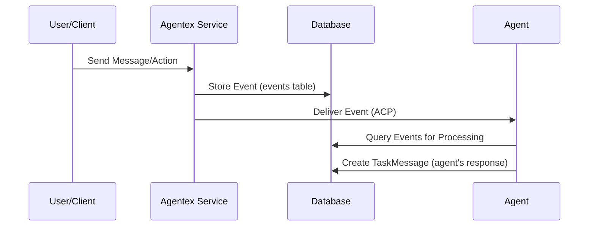

# Events

Events are persistent database records that coordinate agent processing workflows in **Agentic ACP only**. They represent activity within tasks and enable event-driven architectures for building sophisticated, distributed agents.

!!! warning "Agentic ACP Only"
    Events are **only available in Agentic ACP**, not Sync ACP. Sync ACP uses direct request/response patterns without events.

## What Are Events?

Events are **processing coordination objects** stored in the events database table. They serve as work items for agents to process, distinct from TaskMessages which represent user-facing conversation history.

**Key Characteristics:**

- **Agentic ACP Only**: Not available in Sync ACP
- **Persistent**: Stored permanently in the events database table
- **Sequential**: Ordered by `sequence_id` for predictable processing
- **Pre-saved**: Written to database **BEFORE** being delivered to agents via ACP
- **Agent-scoped**: Associated with specific task/agent combinations

## Event Structure

```python
class Event:
    id: str                    # Unique event identifier
    sequence_id: int           # Sequential ordering within task/agent
    task_id: str              # Associated task
    agent_id: str             # Target agent
    created_at: datetime      # When event was created
    content: TaskMessageContent  # Optional processing content
```

## When to Use Events

Use events in Agentic ACP when you need:

- **Batch Processing**: Accumulate multiple events and process together
- **Progress Tracking**: Track which events have been processed
- **Resumable Processing**: Resume from specific event positions after failures
- **Event-Driven Architecture**: React to events rather than direct messages

## Event Processing Flow

The event processing flow in Agentic ACP:

1. **User Action**: User sends message or performs action  
2. **Event Created**: Event written to events table **BEFORE** ACP delivery
3. **Event Delivered**: Agent receives event via `on_task_event_send`
4. **Agent Processing**: Agent processes event and creates TaskMessages as needed
5. **Agent Response**: Agent creates TaskMessages for user-facing responses



## Database Write Guarantees

**Critical**: Events are written to the database **BEFORE** being sent to agents, ensuring durability and queryability even if delivery fails.

## Basic Event Usage

```python
# Get specific event
event = await adk.events.get(event_id="event_123")

# List events for task/agent
events = await adk.events.list_events(
    task_id="task_123",
    agent_id="agent_456"
)

# Get events since last processed position (cursor-based)
unprocessed_events = await adk.events.list_events(
    task_id="task_123",
    agent_id="agent_456", 
    last_processed_event_id="last_processed_event_id",
    limit=50
)
```

## Events vs TaskMessages

| **Events** | **TaskMessages** |
|------------|------------------|
| **Processing coordination** | **User conversation** |
| Stored in events table | Stored in messages table |
| Agent processing workflow | User-facing chat history |
| Written before ACP delivery | Created by users/agents directly |
| Sequential by `sequence_id` | Chronological by `created_at` |

**Use Both Together:**
```python
@acp.on_task_event_send
async def handle_with_context(params: SendEventParams):
    # Get processing context from events
    events = await adk.events.list_events(
        task_id=params.task.id,
        agent_id=params.agent.id
    )
    
    # Get conversation context from messages
    messages = await adk.messages.list(task_id=params.task.id)
    
    # Process with full context and create user-facing response
    response = await process_with_context(events, messages)
    
    # Agent creates TaskMessage (not the server)
    await adk.messages.create(
        task_id=params.task.id,
        content=response
    )
```

## Key Points

- **Agentic ACP Only**: Events are not available in Sync ACP
- **Pre-stored**: Events written to database before ACP delivery
- **Agent Creates Messages**: Agent developers create TaskMessages, not the server
- **Cursor-Based**: Use with Agent Task Tracker for progress tracking

## Next Steps

- Learn about [Agent Task Tracker](agent_task_tracker.md) for distributed coordination
- Explore [State Management](state.md) for maintaining agent context
- See [Critical Concepts - Events vs Messages](callouts/events_vs_messages.md) for critical distinctions
- Review the [Tutorials](../tutorials.md) for hands-on examples 