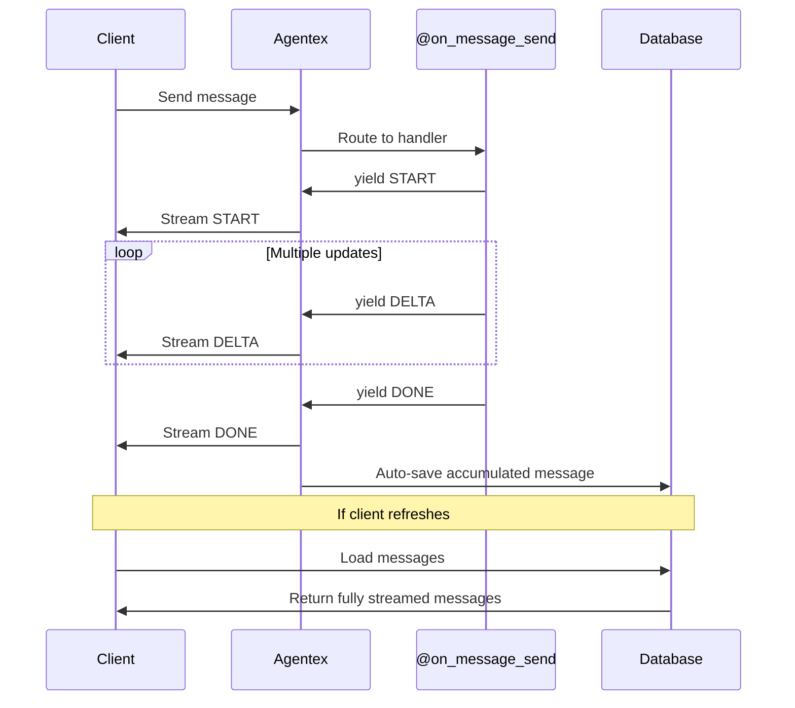
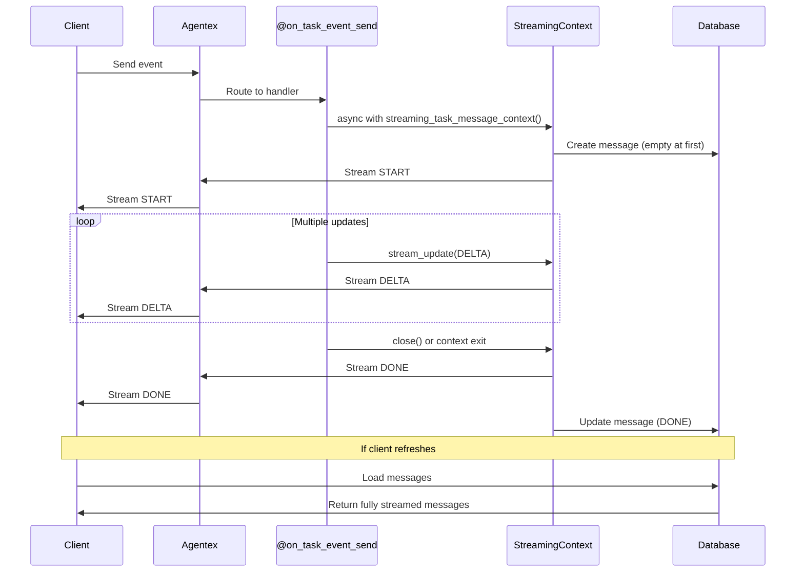

# Streaming Concepts

Streaming enables real-time delivery of messages as they're being generated, providing responsive user experiences for long-running operations.

## What is Streaming?

**Streaming** in Agentex allows agents to send partial message updates while processing, rather than waiting to send a complete response. This creates fluid, responsive interactions where users see progress in real-time.

Agentex decouples streaming from LLM provider streaming. You're not limited to streaming LLM responses - you can stream any content: progress updates, status messages, multi-step workflows, or custom notifications.


## Streaming by Agent Type

The way you work with streaming depends on which agent type you're using: [Sync Agents](../agent_types/sync.md) or [Async Agents](../agent_types/async/overview.md).

### Sync Agent Streaming

In Sync Agents, you yield `TaskMessageUpdate` objects from your handler, and Agentex automatically persists the streamed message.

**Enabling streaming is simple:** Switch from returning `TaskMessageContent` to yielding `TaskMessageUpdate` objects. That's it - your agent automatically becomes a streaming agent.

```python
# Non-streaming (return)
@acp.on_message_send
async def handle_message_send(params: SendMessageParams):
    return TextContent(author=MessageAuthor.AGENT, content="Response")

# Streaming (yield)
@acp.on_message_send
async def handle_message_send(params: SendMessageParams):
    yield StreamTaskMessageStart(index=0, content=TextContent(...))
    yield StreamTaskMessageDelta(index=0, delta=TextDelta(text_delta="Response"))
    yield StreamTaskMessageDone(index=0)
```

**How it works:**

1. **You yield updates**: Your `@acp.on_message_send` handler yields `StreamTaskMessageStart`, `StreamTaskMessageDelta`, and `StreamTaskMessageDone` objects
2. **Agentex streams to client**: Updates are sent to the client in real-time as you yield them
3. **Agentex persists automatically**: When streaming completes, Agentex saves the final accumulated message to conversation history

You control what to stream (LLM output, progress updates, custom content), but Agentex handles delivery and persistence.

**Using `index` to Create Multiple Messages:**

The `index` parameter controls which message a stream update belongs to. Since Agentex creates messages on your behalf, you use `index` to separate multiple messages. Increment the index each time you want to create a distinct message:

```python
@acp.on_message_send
async def handle_message_send(params: SendMessageParams):
    # First message (index=0)
    yield StreamTaskMessageStart(index=0, content=TextContent(...))
    yield StreamTaskMessageDelta(index=0, delta=TextDelta(text_delta="Message 1"))
    yield StreamTaskMessageDone(index=0)
    
    # Second message (index=1) - separate message
    yield StreamTaskMessageStart(index=1, content=TextContent(...))
    yield StreamTaskMessageDelta(index=1, delta=TextDelta(text_delta="Message 2"))
    yield StreamTaskMessageDone(index=1)
    
    # Result: Agentex creates 2 separate messages in conversation history
```

**Lifecycle:**



### Async Agent Streaming

In Async Agents, you use the `adk.streaming` API with a context manager pattern to control streaming, and messages are automatically persisted when the context closes.

**How it works:**

1. **Create and open a streaming context**: Use `async with adk.streaming.streaming_task_message_context()` to create the message and send START (or call `await context.open()` for manual control)
2. **Stream updates**: Call `await context.stream_update()` to send DELTA or FULL updates to the client
3. **Close the context**: Call `await context.close()` to persist the accumulated message and send DONE (not needed if you use `async with` - it closes automatically)

The context manager handles message creation, streaming delivery, and automatic persistence.

!!! warning "Temporal Workflows and Streaming"
    Streaming contexts cannot span across multiple Temporal activities because they maintain state through a generator pattern. When using Temporal workflows, you must wrap the entire streaming operation (create, open, stream updates, close) inside a single activity. For detailed guidance on handling streaming in Temporal workflows, see the [Temporal Development Overview](../temporal_development/overview.md).

**Lifecycle:**



## Async Streaming Example

Here's a complete example showing how to stream content in an Async Agent:

```python
from agentex.lib import adk
from agentex.lib.types.acp import SendEventParams
from agentex.types.text_content import TextContent
from agentex.types.task_message_delta import TextDelta
from agentex.types.task_message_update import (
    StreamTaskMessageDelta,
    StreamTaskMessageFull,
)

@acp.on_task_event_send
async def handle_event_send(params: SendEventParams):
    # Echo the user's message
    if params.event.content:
        await adk.messages.create(
            task_id=params.task.id,
            content=params.event.content,
        )
    
    # Example 1: Complete message streaming using context manager
    # Best for messages where you know the full content upfront
    async with adk.streaming.streaming_task_message_context(
        task_id=params.task.id,
        initial_content=TextContent(
            author="agent",
            content="Analyzing your request...",
        ),
    ) as streaming_context:
        # Stream a full message update
        await streaming_context.stream_update(
            StreamTaskMessageFull(
                parent_task_message=streaming_context.task_message,
                content=TextContent(
                    author="agent",
                    content="Analysis complete!",
                ),
                type="full",
            )
        )
    # Context automatically closes, sends DONE, and persists the message
    
    # Example 2: Delta-based streaming for incremental updates
    # Best for streaming LLM responses or progress updates
    streaming_context = adk.streaming.streaming_task_message_context(
        task_id=params.task.id,
        initial_content=TextContent(
            author="agent",
            content="",  # Start with empty content
        ),
    )
    
    # Open manually (without async with)
    await streaming_context.open()
    
    try:
        # Stream text deltas incrementally
        async for chunk in generate_response():
            await streaming_context.stream_update(
                StreamTaskMessageDelta(
                    parent_task_message=streaming_context.task_message,
                    delta=TextDelta(text_delta=chunk, type="text"),
                    type="delta",
                )
            )
    finally:
        # Always close to persist the accumulated message
        await streaming_context.close()

async def generate_response():
    """Example generator that yields text chunks"""
    chunks = ["Hello ", "from ", "the ", "agent!"]
    for chunk in chunks:
        yield chunk
```

!!! tip "Use the SDK for Streaming"
    We highly recommend using the SDK's `adk.streaming` API to handle the streaming lifecycle because it also handles message persistence, which can be complicated. If you need low-level control over the streaming internals, you can read the source code for the streaming implementation.
