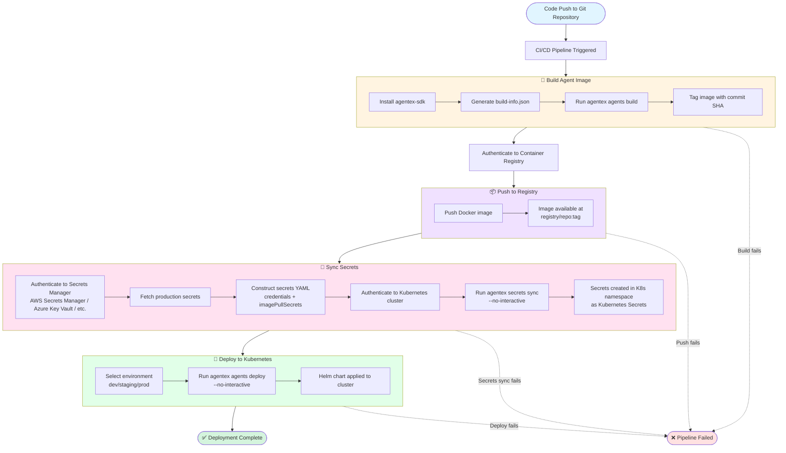

agentex/docs/docs/deployment/cicd.md# Integrate CI/CD

This guide shows how to integrate Agentex into your CI/CD pipeline to automatically build, push, and deploy your agent to a Kubernetes cluster whenever code changes are pushed to your repository.

---

## Overview

Agentex's deployment commands (`agentex agents build`, `agentex secrets sync`, `agentex agents deploy`) are designed to run in any CI/CD system—GitHub Actions, GitLab CI, Jenkins, CircleCI, Azure DevOps, Bitbucket Pipelines, or your custom automation.

!!! note "Examples Use GitHub Actions"
    The examples in this guide use **GitHub Actions** syntax, but the core Agentex commands (`agentex agents build`, `agentex secrets sync`, `agentex agents deploy`) work identically in any CI/CD platform. Only the authentication mechanisms and pipeline syntax differ between platforms—the Agentex deployment commands remain the same.

### The Pipeline Flow

The diagram below illustrates a typical end-to-end automation workflow. The four **core Agentex stages** are:

1. **Build** - Create a Docker image of your agent with version metadata
2. **Push** - Upload the image to your container registry (GCR, ECR, ACR, GitHub Container Registry)
3. **Sync Secrets** - Inject credentials from your secrets manager into the Kubernetes namespace
4. **Deploy** - Roll out the agent to Kubernetes using Helm with environment-specific configurations

Each stage requires authentication (to your registry, secrets manager, and Kubernetes cluster), which you'll configure using your CI/CD platform's secrets management (environment variables, secret stores, workload identity, etc.).

**Customize to your process**: These four stages are the essential Agentex deployment steps, but you can integrate them into your organization's existing release process. Common additions include testing phases (run unit tests before build, integration tests after build), security scanning (vulnerability scanning, SAST/DAST), manual approval gates for production, compliance checks, and custom notifications. The Agentex commands fit seamlessly into any CI/CD workflow structure.

### Example Pipeline Architecture

!!! note "Example Integration Pattern"
    The diagram below shows **one example** of how these stages can be orchestrated. Your implementation may differ based on your CI/CD platform (GitHub Actions, GitLab CI, Jenkins, etc.), infrastructure choices (cloud provider, registry, secrets manager), and you may integrate additional steps based on your organization's requirements—testing phases, security scanning, approval workflows, or other custom validation steps. The core four-stage pattern (Build → Push → Secrets Sync → Deploy) remains consistent, but you control what happens before, between, and after these stages.



---

## Prerequisites

Before setting up the CI/CD pipeline, ensure you have:

### Infrastructure

- **Kubernetes cluster** - Access to a Kubernetes cluster where you'll deploy
- **Namespace** - A namespace provisioned for your agent (e.g., `agentex-agents`)
- **Container registry** - Docker registry to store images (GCR, ECR, ACR, or GitHub Container Registry)
- **Secret management** - System for storing production secrets (AWS Secrets Manager, Azure Key Vault, etc.)

### Permissions

- **Cluster RBAC** - Permissions to create deployments, secrets, and services in your namespace
- **Registry access** - Ability to push images to your container registry
- **GitHub repository access** - Admin access to add workflows and secrets (if using GitHub Actions, or equivalent access for your CI/CD platform)

### Local Setup (for testing)

- **kubectl** - Installed and configured with access to your cluster
- **agentex-sdk** - Installed locally for testing commands

Verify your setup:

```bash
kubectl config current-context  # Check cluster connection
kubectl get namespace your-namespace  # Verify namespace exists
kubectl auth can-i create deployments -n your-namespace  # Check permissions
```

---

## Pipeline Overview

The pipeline will need to:

1. Build agent image
2. Push this image to the registry
3. Sync secrets to Kubernetes namespace
4. Deploy agent image to the namespace

### Building agent

For this step, you will need to decide which Docker registry you will use to store the built agent images.

For example, you may decide to use the Azure, Google, or AWS Container Registry.

Whichever registry you choose, you will need to make sure to authenticate your CI/CD runner which executes your pipeline.

As an example for GitHub Actions, if using Azure you might have a step in your job which uses the `azure/login` package and then calls `az acr login --name your-registry-here`.

You may also choose to generate some build information as part of your CI/CD pipeline, like the build date or commit author.

If you want to have this show up in the agent's deployment history view, you can write this info to a `build-info.json` file in the agent's `project` directory.

The following fields are supported and will be parsed out into the deployment history view:

```bash

{
  "agent_path": "agents/myagent",
  "agent_repo": "https://github.com/your/repo",
  "agent_commit": "shahash",
  "build_time": "2025-10-25T14:30:00.000Z",
  "author_name": "John Doe",
  "author_email": "doe@example.com",
  "branch_name": "main"
}
```

Finally, you will want to make sure the agentex SDK is installed (e.g. with `pip install agentex-sdk`) and then run the build command as described in the overview:
```bash
agentex agents build \
  --manifest "agents/myagent/manifest.yaml" \
  --registry "your-registry-here" \ # e.g. ghcr.io
  --tag "your-image-tag" \
  --platforms "linux/amd64" \
  --repository-name your-repository-name \
  --push 
```

This will build and push your agent image to `your-registry-here/your-repository-name:your-image-tag` where it will be available to deploy.

### Syncing Secrets

Agents require credentials (API keys, database URLs, etc.) that live in your secrets manager (AWS Secrets Manager, Azure Key Vault, etc.), not in code. The `agentex secrets sync` command bridges your secrets manager to Kubernetes by injecting credentials directly into the target namespace.

**Authentication requirements**: Your CI/CD runner (e.g., GitHub Actions runner) needs access to both your secrets manager (to read secrets) and your Kubernetes cluster (to create Secret objects).

**How it works**: The workflow fetches secrets from your secrets manager and constructs a YAML file containing the credentials and image pull secrets. This YAML is then passed to the sync command, which creates Kubernetes Secret objects in your namespace.

**Secrets YAML structure:**

```yaml
credentials:
  API_KEY_1:
    api-key-jdoe: abc12345
    api-key-jsmith: def6789
  REDIS_URL_SECRET:
    redis-url-secret: redis://localhost/
imagePullSecrets:
  pull-secret-1:
    registry: registry-url
    username: jdoe
    password: token
    email: doe@example.com
```

- **`credentials`** map to the `credentials` section in your manifest. Each secret name contains key-value pairs for the actual credentials.
- **`imagePullSecrets`** map to registry credentials needed to pull private images. Include registry URL, username, and password/token.

Once you've constructed the secrets YAML (typically by fetching from your secrets manager in the pipeline), sync them with:

```bash
agentex secrets sync
  --manifest "path/to/agent/manifest.yaml" \
  --cluster desired-cluster \
  --namespace agent-namespace \
  --values prod-secrets.yaml \
  --no-interactive
```

### Deploying

Once an image has been built and pushed to the container registry of your choice, and all the secrets have been synced to the Kubernetes namespace, the last remaining step is to deploy the tagged image.

As in the previous section, this step will require that your CI/CD runner has access to the Kubernetes cluster where you wish to deploy this agent.

Agentex supports environment based helm overrides via the `environments.yaml` file which lives in the same directory as the manifest. You can use any of the environment names specified there to include the appropriate overrides like number of replicas, resource requirements, or additional environment variables.

Beyond this, you can use the same manifest, cluster, and namespace values as before when syncing secrets as well as the repository and tag values used when pushing the image in the first section. 

The full command to deploy will look something like this:

```bash
agentex agents deploy \
  --environment your-env \
  --manifest "path/to/agent/manifest.yaml" \
  --cluster desired-cluster \
  --namespace agent-namespace \
  --repository your-registry.com/your-repo-name \
  --tag image-tag-from-above \
  --no-interactive
```

---

## Next Steps

- Review [Deployment Commands](commands.md) for detailed command documentation
- Configure [Manifest Configuration](../manifest_setup.md) for your agent
- Set up monitoring and alerting for your deployed agents
- Create a staging environment for testing before production deployments