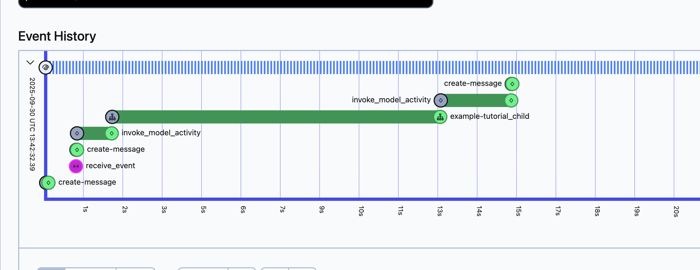
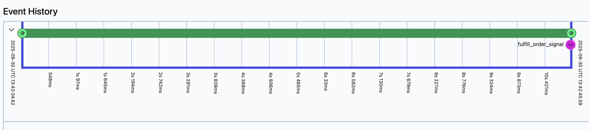

# Human-in-the-Loop Pattern

Enable agents to wait indefinitely for human approval without losing context, using Temporal signals and child workflows.

## The Problem

Your agent needs human approval before taking action, but:
- Waiting blocks the agent
- System might crash while waiting
- Context/state could be lost
- Can't resume after interruption

**Example scenarios:** Financial transactions, legal document signing, high-stakes decisions requiring compliance approval.

---

## Prerequisites

Before implementing this pattern:
- OpenAI SDK plugin configured (see [OpenAI SDK Integration Guide](../guides/openai_temporal_integration.md))
- Understanding of Temporal workflows and signals

---

## Key Concepts

### Signals
External systems can send messages to running workflows. Think of them as secure, durable event triggers.

**Use cases:** User approvals, webhook notifications, live data feeds, external system updates

**Learn more:** [Temporal Message Passing](https://docs.temporal.io/develop/python/message-passing#send-signal-from-client)

### Child Workflows
Spawn independent workflows managed by a parent. They inherit all Temporal durability guarantees.

**Use cases:** Long-running sub-processes, parallel operations, approval workflows

**Learn more:** [Temporal Child Workflows](https://docs.temporal.io/develop/python/child-workflows)

---

## The Pattern

### Step 1: Create the Confirmation Tool

```python
# tools.py
from agents import function_tool
from temporalio import workflow
from temporalio.workflow import ParentClosePolicy
from project.child_workflow import ApprovalWorkflow
from agentex.lib.environment_variables import EnvironmentVariables

environment_variables = EnvironmentVariables.refresh()

@function_tool
async def wait_for_confirmation(action: str) -> str:
    """Wait for human approval before proceeding"""

    result = await workflow.execute_child_workflow(
        ApprovalWorkflow.run,
        environment_variables.WORKFLOW_NAME + "_approval",
        id=f"approval-{workflow.uuid4()}",
        parent_close_policy=ParentClosePolicy.TERMINATE,
    )

    return result
```

### Step 2: Create Child Workflow for Approval

```python
# child_workflow.py
import asyncio
from temporalio import workflow
from agentex.lib.utils.logging import make_logger
from agentex.lib.environment_variables import EnvironmentVariables

environment_variables = EnvironmentVariables.refresh()
logger = make_logger(__name__)

@workflow.defn(name=environment_variables.WORKFLOW_NAME + "_approval")
class ApprovalWorkflow:
    def __init__(self):
        self._approval_queue: asyncio.Queue[bool] = asyncio.Queue()

    @workflow.run
    async def run(self, action: str) -> str:
        logger.info(f"Waiting for approval: {action}")

        # Wait until signal received
        await workflow.wait_condition(
            lambda: not self._approval_queue.empty()
        )

        # Approval received
        approved = await self._approval_queue.get()
        return "Approved" if approved else "Rejected"

    @workflow.signal
    async def approve(self, approved: bool) -> None:
        """Signal to approve or reject"""
        await self._approval_queue.put(approved)
```

### Step 3: Use in Your Agent

```python
# workflow.py
from agents import Agent, Runner
from project.tools import wait_for_confirmation

approval_agent = Agent(
    name="Approval Agent",
    instructions="When asked to perform an action, use wait_for_confirmation to get human approval first.",
    tools=[wait_for_confirmation],
)

result = await Runner.run(approval_agent, params.event.content.content)
```

### Step 4: Trigger Approval

Send the signal when human approves:

```bash
# Via Temporal CLI
temporal workflow signal \
  --workflow-id="approval-workflow-id" \
  --name="approve" \
  --input=true
```

Or programmatically:

```python
# Via Temporal client
from temporalio.client import Client

client = await Client.connect("localhost:7233")
handle = client.get_workflow_handle("approval-workflow-id")
await handle.signal("approve", True)
```

---

## Why This Works

### Durable Waiting

**Without Temporal:**
- Agent blocks resources while waiting
- If system crashes, approval context is lost
- Have to restart the entire process

**With Temporal:**
- Agent waits without consuming resources
- System crashes don't matter - workflow resumes
- Full context preserved indefinitely
- Can wait hours, days, or weeks

### Workflow Visualization

**Parent workflow spawns child for approval:**



The parent workflow waits for the child to complete, which happens when the signal is received.

**Child workflow waits for signal:**



The child workflow runs until the `approve` signal is triggered, then completes.

---

## When to Use This Pattern

**✅ Use when:**
- High-stakes decisions requiring human oversight
- Compliance/audit requirements mandate approval
- Financial transactions need authorization
- Legal or regulatory approval workflows
- Multi-day approval processes

**❌ Don't use when:**
- Immediate response required
- Fully automated agents (no human needed)
- Simple validation (use synchronous checks instead)

---

## Real-World Applications

### Financial Services
- Large transaction approvals
- Fraud investigation holds
- Credit limit increases
- Account closures

### Healthcare
- Treatment plan approvals
- Prescription authorizations
- Medical record updates

### Enterprise
- Contract signing workflows
- Procurement approvals
- Data access requests
- Security incident responses

---

## Advanced: Multiple Approval Stages

For workflows requiring multiple approvals:

```python
# Sequential approvals
manager_approval = await wait_for_approval("manager")
if manager_approval == "Approved":
    director_approval = await wait_for_approval("director")
```

---

## Game-Changing Benefits

This pattern enables **true transactional agent behavior:**

- **Guaranteed execution** - Workflow will complete even through failures
- **Exact resumption** - Picks up exactly where it left off
- **Context preservation** - All state maintained during wait
- **Indefinite waiting** - Can wait for human input without resource consumption

**Without this foundation, agents remain fragile. With Temporal, they become production-ready systems that seamlessly integrate human oversight.**

---

## See Also

- **[OpenAI SDK Integration Guide](../guides/openai_temporal_integration.md)** - Setup and configuration
- **[Multi-Activity Tools Pattern](multi_activity_tools.md)** - Combine with multi-step operations
- **[Temporal Signals](https://docs.temporal.io/develop/python/message-passing)** - Deep dive into signals
- **[GitHub Example](https://github.com/scaleapi/scale-agentex-python/tree/main/examples/tutorials/10_agentic/010_temporal/080_open_ai_agents_sdk_human_in_the_loop)** - Full working code
