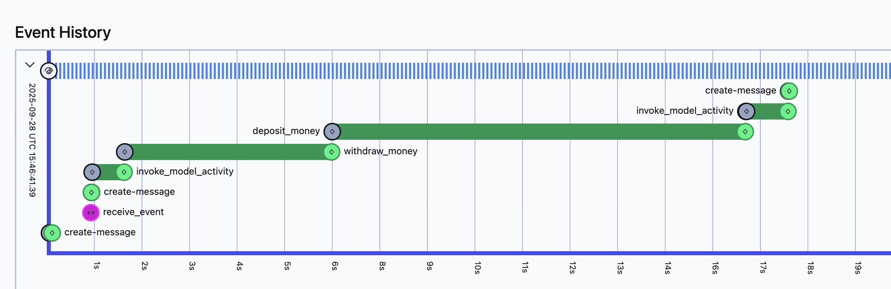

# Multi-Activity Tools Pattern

Build atomic multi-step operations within a single tool call using Temporal's sequential activity execution.

## The Problem

You need a tool that performs multiple external operations that must complete together - like transferring money (withdraw + deposit) or processing an order (validate + charge + ship).

**Challenge:** Relying on the LLM to make separate tool calls is unreliable:
- LLM might only call withdraw, never deposit (money lost!)
- No guarantee of execution order
- Can't recover from partial completion

**Solution:** Create one tool with multiple activities executed sequentially.

---

## Prerequisites

Before using this pattern, ensure you have:
- OpenAI SDK plugin configured (see [OpenAI SDK Integration Guide](../guides/openai_temporal_integration.md))
- Basic understanding of Temporal activities

---

## The Pattern

### Step 1: Create Individual Activities

```python
# activities.py
from temporalio import activity
import asyncio

@activity.defn
async def withdraw_money(from_account: str, amount: float) -> str:
    """Withdraw money from an account"""
    # Simulates API call (in production: actual banking API)
    await asyncio.sleep(5)
    print(f"Withdrew ${amount} from {from_account}")
    return f"Successfully withdrew ${amount} from {from_account}"

@activity.defn
async def deposit_money(to_account: str, amount: float) -> str:
    """Deposit money into an account"""
    # Simulates API call (in production: actual banking API)
    await asyncio.sleep(10)
    print(f"Deposited ${amount} into {to_account}")
    return f"Successfully deposited ${amount} into {to_account}"
```

### Step 2: Register Activities

```python
# run_worker.py
from agentex.lib.core.temporal.activities import get_all_activities
from project.activities import withdraw_money, deposit_money

all_activities = get_all_activities() + [withdraw_money, deposit_money]

await worker.run(
    activities=all_activities,
    workflow=YourWorkflow,
)
```

### Step 3: Create Multi-Activity Tool

```python
# tools.py
from agents import function_tool
from temporalio import workflow
from datetime import timedelta

@function_tool
async def move_money(from_account: str, to_account: str, amount: float) -> str:
    """Move money from one account to another atomically"""

    # Step 1: Withdraw money
    withdraw_result = await workflow.start_activity(
        "withdraw_money",
        args=[from_account, amount],
        start_to_close_timeout=timedelta(days=1)
    )

    await withdraw_result

    # Step 2: Deposit money (only happens if withdraw succeeds)
    deposit_result = await workflow.start_activity(
        "deposit_money",
        args=[to_account, amount],
        start_to_close_timeout=timedelta(days=1)
    )

    await deposit_result

    return f"Successfully moved ${amount} from {from_account} to {to_account}"
```

### Step 4: Use the Tool

```python
# workflow.py
from agents import Agent, Runner
from project.tools import move_money

money_agent = Agent(
    name="Money Transfer Agent",
    instructions="Use the move_money tool to transfer funds between accounts.",
    tools=[move_money],
)

result = await Runner.run(money_agent, params.event.content.content)
```

---

## Why This Works

### Guaranteed Sequential Execution

```
1. LLM decides to call move_money tool
2. Activity: withdraw_money executes
   → If fails: Temporal retries automatically
   → If succeeds: Proceeds to next step
3. Activity: deposit_money executes
   → If fails: Temporal retries automatically
   → Withdraw already completed (durable state)
4. Tool returns success
5. LLM continues with confirmation
```

### Transactional Guarantees

- **Atomic operations**: Both complete or workflow handles partial state
- **Exact resumption**: If system crashes, resumes at exact activity
- **No lost updates**: Temporal's event sourcing ensures no data loss
- **Automatic retries**: Failed activities retry without manual intervention

### What You See in Production


The agent successfully transfers money with full context.



Temporal UI shows both activities, execution times, and parameters - full observability into the transactional operation.

---

## When to Use This Pattern

**✅ Use when:**
- Multiple external API calls must complete together
- Order of operations matters
- Partial completion is dangerous (e.g., money withdrawn but not deposited)
- Need guaranteed execution with retries
- Operations can take minutes/hours to complete

**❌ Don't use when:**
- Single operation is sufficient
- Operations are independent (use separate tools instead)
- Operations are deterministic (no need for activities)

---

## Real-World Examples

### Financial Operations
- Transfer money (withdraw + deposit)
- Process payment (authorize + capture)
- Refund transaction (cancel charge + return funds)

### E-Commerce
- Process order (validate + charge + create shipment)
- Cancel order (refund + cancel shipment + update inventory)

### Data Processing
- ETL pipeline (extract + transform + load)
- Multi-stage analysis (fetch + process + store)

---

## See Also

- **[OpenAI SDK Integration Guide](../guides/openai_temporal_integration.md)** - Setup and basic usage
- **[Human-in-the-Loop Pattern](human_in_the_loop.md)** - Add approval to multi-activity operations
- **[Temporal Activities Docs](https://docs.temporal.io/activities)** - Deep dive into Temporal activities
