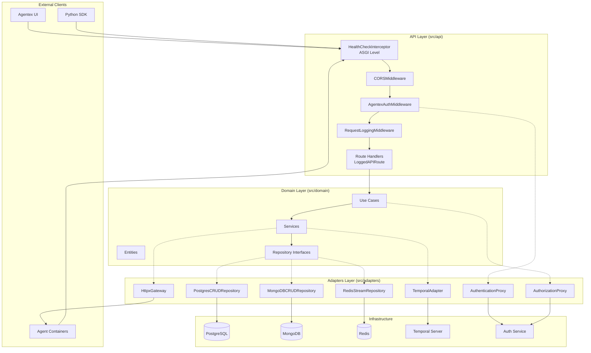
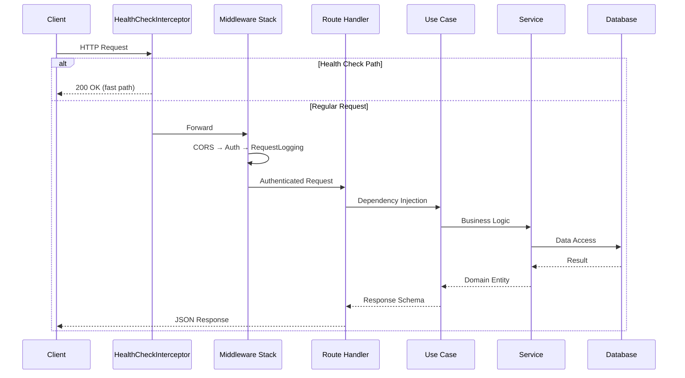
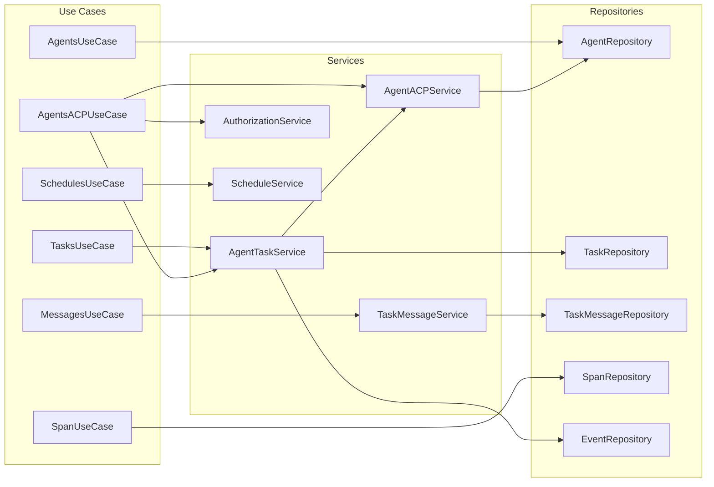
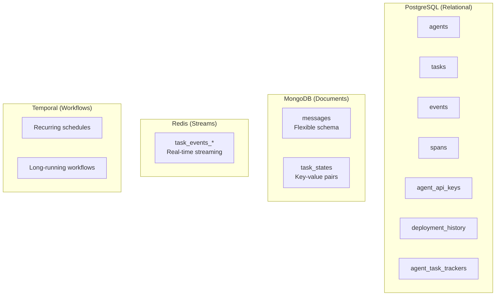
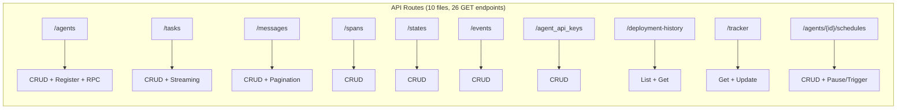
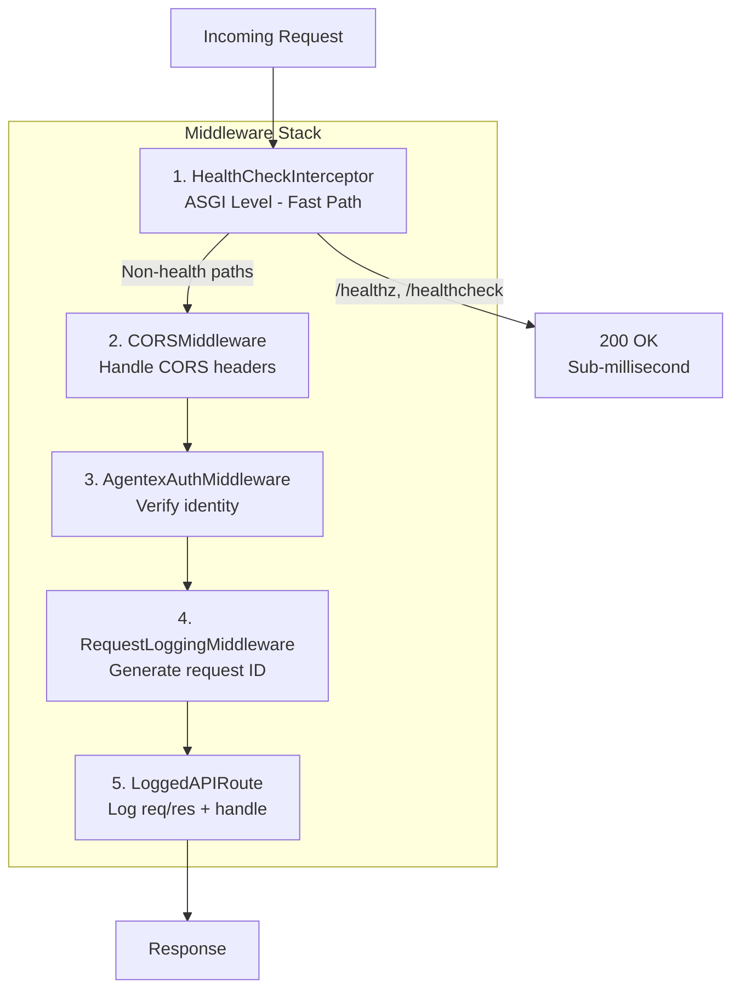

# Internal Architecture

This document describes the internal code architecture of the Agentex backend. For a high-level conceptual overview, see [Agentex Overview](../getting_started/agentex_overview.md).

## High-Level Architecture (Hexagonal/Clean Architecture)

The codebase follows a **Hexagonal Architecture** (also known as Ports & Adapters) with clear separation between layers:



---

## Request Flow

Every HTTP request follows this path through the system:



---

## Domain Layer Structure

The domain layer follows a layered pattern with clear responsibilities:

- **Use Cases**: Application-level orchestration, convert between API schemas and domain entities
- **Services**: Business logic, coordinate between repositories
- **Repositories**: Data access interfaces (implemented by adapters)



---

## Data Storage Split

Data is split across different storage backends based on access patterns:



| Storage | Use Case | Why |
|---------|----------|-----|
| **PostgreSQL** | Agents, Tasks, Spans, Events | Relational integrity, ACID transactions, complex queries |
| **MongoDB** | Messages, States | Flexible schema for varied content types, document-oriented |
| **Redis** | Task event streams | Real-time pub/sub, SSE streaming to clients |
| **Temporal** | Schedules, Workflows | Durable workflow orchestration, reliable scheduling |

---

## API Routes Overview

All routes are organized in `src/api/routes/`:



---

## Middleware Stack

Middleware executes in this order (first to last):



| Middleware | Purpose |
|------------|---------|
| **HealthCheckInterceptor** | ASGI-level fast path for Kubernetes probes |
| **CORSMiddleware** | Handle cross-origin requests |
| **AgentexAuthMiddleware** | Verify agent identity or auth tokens |
| **RequestLoggingMiddleware** | Generate request ID for log correlation |
| **LoggedAPIRoute** | Log requests/responses, handle streaming |

---

## Key Files Reference

| Layer | Directory | Key Files |
|-------|-----------|-----------|
| **API** | `src/api/` | `app.py`, `logged_api_route.py`, `authentication_middleware.py` |
| **Routes** | `src/api/routes/` | `agents.py`, `tasks.py`, `messages.py`, `spans.py`, etc. |
| **Domain** | `src/domain/` | `entities/`, `use_cases/`, `services/`, `repositories/` |
| **Adapters** | `src/adapters/` | `crud_store/`, `temporal/`, `streams/`, `http/` |
| **Config** | `src/config/` | `dependencies.py`, `environment_variables.py` |

---

## Dependency Injection

Dependencies are managed via FastAPI's dependency injection with a singleton pattern:

```python
# In src/config/dependencies.py
class GlobalDependencies(metaclass=Singleton):
    database_async_read_write_engine: AsyncEngine
    temporal_client: TemporalClient
    mongodb_database: MongoDBDatabase
    redis_pool: redis.ConnectionPool

# In routes, use Annotated types
async def get_agent(
    agent_id: str,
    agents_use_case: DAgentsUseCase,  # Auto-injected
) -> AgentResponse:
    ...
```

This pattern ensures:

- Single connection pools shared across requests
- Easy testing via dependency overrides
- Clear dependency graphs
- Proper lifecycle management (startup/shutdown)
