# Race Conditions in Async ACP

!!! danger "Critical for Production Systems"
    **All async ACP types can experience race conditions that corrupt agent state and cause unpredictable behavior.** Temporal ACP handles these better through singleton workflows and message queuing, but understanding race conditions is crucial for all production systems.

## The Core Problem

In **all async ACP types**, multiple events can trigger concurrent processing, leading to race conditions where agents compete for the same resources and corrupt each other's state.

**Temporal ACP** handles this better because workflows are singleton instances with built-in message queuing, while **Base ACP** requires manual race condition handling.

### ❌ What Happens with Race Conditions (All Async ACP)

```python
# Any async ACP - Multiple events can trigger simultaneously
@acp.on_task_event_send
async def handle_event_send(params: SendEventParams):
    # 🚨 RACE CONDITION: Two events arrive at the same time
    # Both executions start processing simultaneously
    
    # Both read the same state
    state = await adk.state.get_by_task_and_agent(
        task_id=params.task.id,
        agent_id=params.agent.id
    )
    
    # Both process their events
    processing_count = state.state.get("processing_count", 0)
    new_count = processing_count + 1
    
    # Both try to update state with the same value!
    state.state["processing_count"] = new_count
    await adk.state.update(state_id=state.id, state=state.state)
    
    # Result: processing_count = 1 instead of 2 (lost update!)
```

### ✅ How Temporal ACP Handles This Better

Here's how the actual Temporal workflow from our tutorials handles events and prevents race conditions:

```python
# From tutorials/10_async/10_temporal/010_agent_chat/project/workflow.py
from temporalio import workflow
from agentex.core.temporal.workflows.workflow import BaseWorkflow
from agentex.core.temporal.types.workflow import SignalName

@workflow.defn(name="at010-agent-chat")
class At010AgentChatWorkflow(BaseWorkflow):
    """
    Temporal workflow that handles events sequentially through signals
    """
    def __init__(self):
        super().__init__(display_name="Agent Chat")
        self._complete_task = False
        self._state = None
        self._task_id = None

    @workflow.signal(name=SignalName.RECEIVE_EVENT)
    async def on_task_event_send(self, params: SendEventParams) -> None:
        # ✅ RACE CONDITION PREVENTION: This signal handler processes
        # events one at a time in the order they were received
        
        logger.info(f"Processing event: {params}")
        
        # Increment turn number - no race condition because only
        # one signal processes at a time
        self._state.turn_number += 1
        # this will be used by OpenAI Agents SDK/Temporal via context variables
        self._task_id = params.task.id
        
        # Add message to history - safe because sequential processing
        self._state.input_list.append({
            "role": "user", 
            "content": params.event.content.content
        })
        
        # Process with LLM - each event gets complete, uninterrupted processing
        test_agent = Agent(
            name="Test Agent",
            instructions="You are a test agent")
        result = await Runner.run(test_agent, self._state.input_list)
        
        # Update state - safe because no concurrent modifications
        self._state.input_list = result.final_output

    @workflow.run
    async def on_task_create(self, params: CreateTaskParams) -> str:
        # Initialize state once when workflow starts
        self._state = StateModel(input_list=[], turn_number=0)
        
        # Wait for completion condition - workflow runs indefinitely
        await workflow.wait_condition(
            lambda: self._complete_task,
            timeout=None
        )
        return "Task completed"
```

## How Temporal's Event Processing Works

Temporal provides race condition protection through sequential event processing:

```mermaid
sequenceDiagram
    participant C1 as Client 1
    participant C2 as Client 2
    participant C3 as Client 3
    participant TS as Temporal Server
    participant WF as Workflow Instance
    
    Note over C1,C3: Multiple events arrive simultaneously
    C1->>TS: Send Event A (10:00:01.100)
    C2->>TS: Send Event B (10:00:01.150)
    C3->>TS: Send Event C (10:00:01.200)
    
    Note over TS: Events queued in order received
    TS->>WF: Signal: Process Event A
    Note over WF: Process Event A completely
    WF-->>TS: Event A complete
    
    TS->>WF: Signal: Process Event B
    Note over WF: Process Event B completely
    WF-->>TS: Event B complete
    
    TS->>WF: Signal: Process Event C
    Note over WF: Process Event C completely
    WF-->>TS: Event C complete
    
    Note over WF: ✅ No race conditions!<br/>Each event processed atomically
```



## Temporal's Race Condition Prevention Mechanisms

### 1. Singleton Workflow Instances

- **One workflow per task ID** - Each task gets exactly one workflow instance
- **Deterministic execution** - Same inputs always produce same results
- **State isolation** - Each workflow has its own isolated state

### 2. Persistent Event History

Temporal automatically maintains a complete history of every event that happens to your workflow. This is why race conditions are much less likely - every state change is recorded and can be replayed exactly.

**What this means for your agent:**

```python
# Your agent handles events like this:
@workflow.signal(name=SignalName.RECEIVE_EVENT)
async def on_task_event_send(self, params: SendEventParams) -> None:
    # Every time this runs, Temporal records:
    # - When the event arrived
    # - What the event contained  
    # - How your workflow state changed
    
    self._state.turn_number += 1  # ← This change is recorded
    self._state.input_list.append({
        "role": "user", 
        "content": params.event.content.content
    })  # ← This change is recorded
    
    # If your workflow crashes and restarts, Temporal will:
    # 1. Replay all events in the exact same order
    # 2. Rebuild your state to the exact same point
    # 3. Continue from where it left off
```

**Example Event History:**
```
10:00:01.100 - Event A: User says "Hello"
               State: turn_number=1, messages=["Hello"]
               
10:00:01.150 - Event B: User says "How are you?"  
               State: turn_number=2, messages=["Hello", "How are you?"]
               
10:00:01.200 - Event C: User says "Goodbye"
               State: turn_number=3, messages=["Hello", "How are you?", "Goodbye"]
```

**Why This Prevents Race Conditions:**

- **Deterministic Replay**: If your workflow restarts, events replay in the exact same order
- **State Consistency**: Your workflow state is always rebuilt the same way
- **No Lost Events**: Every event is permanently recorded, none can be lost or processed twice

### 3. Sequential Signal Processing

```python
# In Temporal workflows, this is guaranteed safe:
@workflow.signal
async def handle_concurrent_events(self, event_data):
    # Even if 100 events arrive simultaneously:
    
    # 1. Read current state - no race condition
    current_count = self.state.get('count', 0)
    
    # 2. Process event - exclusive access guaranteed
    processed_data = await expensive_processing(event_data)
    
    # 3. Update state - atomic within signal handler
    self.state['count'] = current_count + 1
    self.state['last_processed'] = processed_data
    
    # 4. Next signal waits until this one completes
    # No lost updates, no race conditions!
```

### 4. Built-in Queuing and Ordering

```python
# Multiple events hitting the same workflow:
# Event A arrives at 10:00:01.100
# Event B arrives at 10:00:01.150  
# Event C arrives at 10:00:01.200

# Temporal automatically:
# 1. Queues them in order: [A, B, C]
# 2. Processes A completely before starting B
# 3. Processes B completely before starting C
# 4. Maintains event history for replay/recovery

@workflow.signal
async def on_task_event_send(self, params):
    # This handler will process:
    # - Event A at 10:00:01.100 (processes fully)
    # - Event B at 10:00:01.500 (waits for A to finish)
    # - Event C at 10:00:01.800 (waits for B to finish)
```

## Base ACP Race Condition Solutions

### Using Agent Task Tracker Cursors for Safe Processing

For Base Async ACP, you can use **Agent Task Tracker cursors** to coordinate processing and reduce race conditions:

```python
@acp.on_task_event_send
async def handle_event_send_with_cursor(params: SendEventParams):
    # ✅ CURSOR-BASED COORDINATION: Use Agent Task Tracker to track progress
    
    # Get current processing position
    tracker = await adk.agent_task_tracker.get_by_task_and_agent(
        task_id=params.task.id,
        agent_id=params.agent.id
    )
    
    # Get unprocessed events since last cursor (batch processing)
    unprocessed_events = await adk.events.list_events(
        task_id=params.task.id,
        agent_id=params.agent.id,
        last_processed_event_id=tracker.last_processed_event_id,
        limit=10  # Process batches of 10
    )
    
    if not unprocessed_events:
        return  # No new events to process
    
    # ✅ RACE CONDITION REDUCTION: Process events in batches
    # instead of individual concurrent handlers
    
    # Process all events in the batch atomically
    results = []
    for event in unprocessed_events:
        result = await process_event(event)
        results.append(result)
    
    # Update state with all results at once
    state = await adk.state.get_by_task_and_agent(
        task_id=params.task.id,
        agent_id=params.agent.id
    )
    
    # Atomic state update with all changes
    state.state["processing_count"] = state.state.get("processing_count", 0) + len(results)
    state.state["last_batch_results"] = results
    
    await adk.state.update(state_id=state.id, state=state.state)
    
    # ✅ CRITICAL: Update cursor ONLY after processing is complete
    await adk.agent_task_tracker.update(
        tracker_id=tracker.id,
        request=UpdateAgentTaskTrackerRequest(
            last_processed_event_id=unprocessed_events[-1].id,
            status_reason=f"Processed batch of {len(unprocessed_events)} events"
        )
    )
```

### Benefits of Cursor-Based Processing

1. **Forward-Only Progress**: Cursors can only move forward, preventing duplicate processing
2. **Batch Coordination**: Process multiple events atomically instead of concurrent individual handlers
3. **Resumable Processing**: Pick up where you left off after failures
4. **State Consistency**: Atomic batch updates reduce concurrent state modifications

### Cursor Safety Rules

!!! danger "Critical Cursor Rules"
    1. **Forward-Only Movement**: Never move cursor backwards
    2. **Update After Success**: Only update cursor after processing is complete
    3. **Atomic Batches**: Process batches atomically to reduce race windows
    4. **Single Source of Truth**: Use cursor as the authoritative processing position

### Comparison: Individual vs Batch Processing

```python
# ❌ RACE-PRONE: Individual event processing
@acp.on_task_event_send
async def race_prone_handler(params: SendEventParams):
    # Each event triggers a separate handler instance
    # Multiple handlers can run concurrently
    # Race conditions likely when updating shared state
    pass

# ✅ RACE-RESISTANT: Cursor-based batch processing
@acp.on_task_event_send  
async def cursor_batch_handler(params: SendEventParams):
    # Use current event as trigger to check for batch
    # Process accumulated events in controlled batches
    # Update cursor after successful batch processing
    pass
```

!!! warning "Not a Complete Solution"
    Agent Task Tracker cursors **reduce** race conditions but don't eliminate them entirely. For complete race condition prevention, use **Temporal Async ACP** which provides guaranteed sequential processing.

## Common Race Condition Scenarios

**1. State Corruption** - Last write wins, updates are lost
**2. Duplicate Processing** - Same event processed multiple times, wasting resources
**3. Inconsistent Behavior** - Agent loses context, conversation history gets corrupted

These issues appear in production when users send rapid messages or multiple webhooks arrive simultaneously.

## Base ACP: Manual Race Condition Handling Required

With Base ACP, you must implement your own race condition protection:

### Option 1: Application-Level Locking

```python
# Use Redis or database locks
@acp.on_task_event_send
async def handle_event_send(params: SendEventParams):
    lock_key = f"task_lock:{params.task.id}:{params.agent.id}"
    
    async with custom_lock(lock_key, timeout=30):
        # Only one execution can run at a time
        state = await adk.state.get_by_task_and_agent(
            task_id=params.task.id,
            agent_id=params.agent.id
        )
        # ... process safely ...
        await adk.state.update(
            state_id=state.id,
            task_id=params.task.id,
            agent_id=params.agent.id,
            state=state.state
        )
```

### Option 2: Event Queuing

Implement your own event queue with separate workers to process events sequentially.


## Temporal ACP: Built-in Race Condition Mitigation

Temporal prevents race conditions through:

**1. Singleton Workflow** - One workflow instance per task ID, all events go to same instance
**2. Sequential Signal Processing** - Signals processed in FIFO order, each completes before next begins
**3. Workflow-Scoped State** - State in workflow memory (`self._state`), no external database contention
**4. Built-in Queuing** - Temporal queues events automatically, maintains order

```python
# Temporal workflow - Race-condition free
@workflow.signal(name=SignalName.RECEIVE_EVENT)
async def on_task_event_send(self, params: SendEventParams) -> None:
    # ✅ Sequential processing guaranteed - no concurrent modifications
    self._state.conversation_history.append(params.event.content.content)
    self._state.turn_number += 1
    # All updates are atomic within signal handler
```

!!! info "Learn More"
    See [Temporal Python Message Passing](https://docs.temporal.io/develop/python/message-passing) for advanced concurrency patterns.

## Common Misconceptions

- ❌ **"Careful coding prevents race conditions"** - Race conditions are subtle and only appear under production load
- ❌ **"Race conditions are rare"** - Common with rapid messages, webhooks, and load-balanced deployments
- ❌ **"asyncio.Lock solves this"** - Only works within a single process, not across distributed pods
- ❌ **"Only Base ACP has races"** - All async types can, Temporal just handles them better

## Key Takeaway

!!! info "Production Recommendation"
    - **All async ACP**: Can experience race conditions under concurrent load
    - **Base ACP**: Requires manual distributed locking/queuing mechanisms
    - **Temporal ACP**: Provides built-in singleton workflows + message queuing for better race condition handling
    - **Best practice**: Use Temporal ACP for production systems to leverage platform-level concurrency protection
    
    Learn more about Temporal's message handling: **[Temporal Python Message Passing](https://docs.temporal.io/develop/python/message-passing)** 