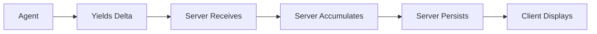
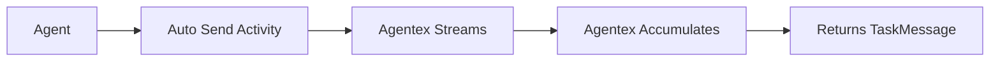
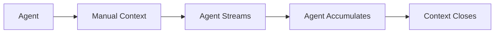
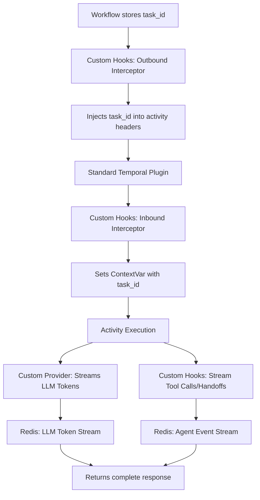
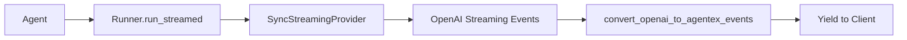
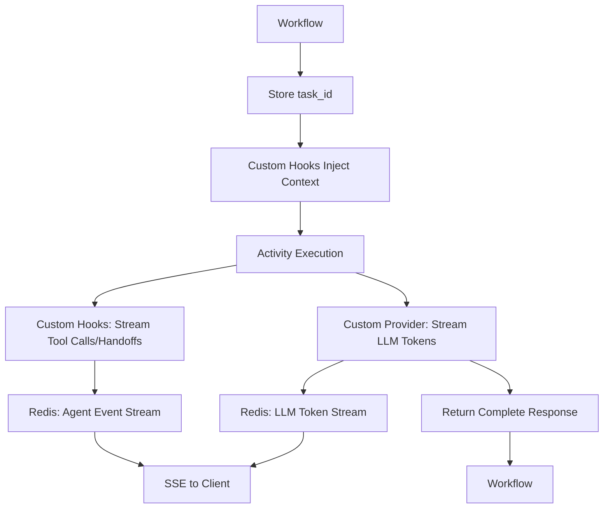

# Streaming & Delta Accumulation

!!! danger "Critical Concept"
    **Different ACP types handle streaming and delta accumulation in fundamentally different ways.** Understanding these differences is essential for proper streaming implementation.

## Core Streaming Patterns

### Sync ACP: Server-Side Delta Accumulation

In **Sync ACP**, delta accumulation happens **server-side** using `AsyncGenerator`. The agent yields deltas, but the **server accumulates and persists** them. You can stream multiple messages, just make sure each has a unique index. The server will automatically accumulate and flush all deltas after the final yield:

```python
# Sync ACP - Return AsyncGenerator, server accumulates deltas
@acp.on_message_send
async def handle_message_send(params: SendMessageParams) -> AsyncGenerator[TaskMessageUpdate, None]:
    # Get conversation history
    task_messages = await adk.messages.list(task_id=params.task.id)
    llm_messages = convert_task_messages_to_llm_messages(task_messages)
    
    message_index = 0
    async for chunk in adk.providers.litellm.chat_completion_stream(
        llm_config=LLMConfig(model="gpt-4o-mini", messages=llm_messages, stream=True),
        trace_id=params.task.id,
    ):
        if chunk.choices and chunk.choices[0].delta.content:
            # YOU yield each delta - SERVER accumulates them
            yield StreamTaskMessageDelta(
                index=message_index,
                delta=TextDelta(text_delta=chunk.choices[0].delta.content)
            )
```

### Async ACP: Three Streaming Options

Becuase Async Agents are completely async, they do not yield nor return anything in their ACP handlers. Instead, they should call the appropriate ADK functions to stream updates to the client.

**Pub/Sub Architecture:**
Agentex uses a **pub/sub mechanism** in the server to handle Async ACP streaming. Clients subscribe to **server-side events (SSE)** from Agentex, which allows them to receive streaming publications from agents in real-time. When an agent streams content, it publishes updates through the ADK, and all subscribed clients receive these updates immediately.

The ADK provides two different streaming approaches for agents behind Async ACPs depending on your needs:

## 1. Auto Send (Recommended for Most Cases)

**Agentex handles everything automatically:**

```python
# Async ACP - Auto send handles all delta accumulation
@acp.on_task_event_send
async def handle_event_send(params: SendEventParams):
    # Echo user message
    await adk.messages.create(task_id=params.task.id, content=params.event.content)
    
    # Auto send: Agentex handles all streaming complexity
    task_message = await adk.providers.litellm.chat_completion_stream_auto_send(
        task_id=params.task.id,
        llm_config=LLMConfig(model="gpt-4o-mini", messages=your_messages, stream=True),
        trace_id=params.task.id,
    )
    
    # Returns complete TaskMessage when streaming finishes
    # Agentex automatically:
    # - Creates initial message
    # - Streams deltas to client
    # - Accumulates chunks into final content  
    # - Sends StreamTaskMessageDone
    # - Returns final TaskMessage for your use
    
    return task_message  # Use for state management
```

**Why Auto Send Exists:**

- **Temporal compatibility**: Temporal workflows cannot yield generators directly (auto send is the easiest option for Temporal ACP)
- **Automatic processing**: Agentex processes streamed chunks automatically
- **Content type packaging**: Automatically packages as proper TextContent, DataContent, or ToolRequestContent
- **Simple**: You don't deal with delta accumulation complexity

## 2. Non-Auto Send (Advanced Control)

**You get full control but handle everything manually:**

```python
# Async ACP - Non-auto send: YOU handle everything
@acp.on_task_event_send
async def handle_event_send(params: SendEventParams):
    # YOU must create the streaming context manually
    async with adk.streaming.streaming_task_message_context(
        task_id=params.task.id,
        initial_content=TextContent(author=MessageAuthor.AGENT, content=""),
    ) as streaming_context:
        
        full_response = ""
        async for chunk in adk.providers.litellm.chat_completion_stream(
            llm_config=LLMConfig(model="gpt-4o-mini", messages=your_messages, stream=True),
            trace_id=params.task.id,
        ):
            if chunk.choices[0].delta.content:
                content = chunk.choices[0].delta.content
                full_response += content  # YOU accumulate chunks
                
                # YOU can transform/filter/analyze each chunk
                processed_content = content.upper()  # Example transformation
                
                # YOU must manually send each chunk to client  
                await streaming_context.stream_update(
                    update=StreamTaskMessageDelta(
                        parent_task_message=streaming_context.task_message,
                        delta=TextDelta(text_delta=processed_content),
                    ),
                )
        
        # Context manager automatically sends StreamTaskMessageDone
    
    # YOU manually add to conversation state
    your_conversation_state.append({"role": "assistant", "content": full_response})
```

**When to Use Non-Auto Send:**

- **Custom processing**: Transform chunks before sending
- **Analytics**: Track streaming metrics
- **Multiple destinations**: Send chunks to multiple places
- **Not supported directly in Temporal workflows**: You CAN use it if you wrap the streaming logic into a custom Temporal activity to avoid crossing network boundaries

!!! info "Custom Activities for Advanced Streaming"
    If you need custom streaming functionality beyond the basic non-auto send pattern, you'll need to wrap your functionality into **custom activities**. Documentation on creating custom activities is coming soon. For now, reach out to the Agentex maintainers for help with implementing custom streaming solutions.

## Delta Accumulation Flow Comparison

### Sync ACP Flow



1. **Agent yields** individual deltas via `AsyncGenerator`
2. **Server receives** each `StreamTaskMessageDelta` in `agents_acp_use_case`
3. **Server accumulates** deltas using `DeltaAccumulator` per message index
4. **Server persists** complete content on `StreamTaskMessageDone`
5. **Client displays** streaming updates in real-time

### Async Auto Send Flow



1. **Agent calls** `chat_completion_stream_auto_send`
2. **Agentex automatically** handles streaming to client
3. **Agentex accumulates** chunks internally
4. **Agent receives** complete `TaskMessage` when done

### Async Non-Auto Send Flow



1. **Agent creates** streaming context manually
2. **Agent handles** each chunk individually  
3. **Agent accumulates** and sends deltas
4. **Context manager** automatically finalizes

## Common Patterns & Mistakes

### ❌ Wrong: Using Non-Auto Send Directly in Temporal Workflow

```python
# This will FAIL in Temporal workflows - generators can't cross network boundaries
@workflow.signal(name=SignalName.RECEIVE_EVENT)
async def on_task_event_send(self, params: SendEventParams):
    async for chunk in adk.providers.litellm.chat_completion_stream(...):
        # ERROR: Temporal workflows cannot yield generators directly!
        pass
```

### ✅ Correct: Using Auto Send in Temporal

```python
# This works correctly in Temporal
@workflow.signal(name=SignalName.RECEIVE_EVENT) 
async def on_task_event_send(self, params: SendEventParams):
    task_message = await adk.providers.litellm.chat_completion_stream_auto_send(
        task_id=params.task.id,
        llm_config=LLMConfig(model="gpt-4o-mini", messages=self._state.input_list, stream=True),
        trace_id=params.task.id,
    )
    # Use task_message.content.content for conversation state
```

### ✅ Correct: Sync ACP Auto-Flush

```python
# Sync ACP - Server automatically flushes deltas at end
@acp.on_message_send
async def handle_message_send(params: SendMessageParams) -> AsyncGenerator[TaskMessageUpdate, None]:
    message_index = 0
    async for chunk in adk.providers.litellm.chat_completion_stream(...):
        if chunk.choices[0].delta.content:
            yield StreamTaskMessageDelta(
                index=message_index,
                delta=TextDelta(text_delta=chunk.choices[0].delta.content)
            )
    
    # Optional: yield StreamTaskMessageDone(index=message_index)
    # Server will auto-flush accumulated deltas even without DONE signal
```

## StreamTaskMessageFull Override Technique

You can **override accumulated deltas** by sending `StreamTaskMessageFull` with the same index:

```python
@acp.on_message_send
async def streaming_with_override(params: SendMessageParams) -> AsyncGenerator[TaskMessageUpdate, None]:
    message_index = 0
    
    # Phase 1: Stream initial response
    accumulated_content = ""
    async for chunk in adk.providers.litellm.chat_completion_stream(...):
        if chunk.choices[0].delta.content:
            accumulated_content += chunk.choices[0].delta.content
            yield StreamTaskMessageDelta(
                index=message_index,
                delta=TextDelta(text_delta=chunk.choices[0].delta.content)
            )
    
    # Phase 2: Override with enhanced content (e.g., add citations)
    enhanced_content = f"{accumulated_content}\n\n## Sources\n{generate_citations()}"
    
    # This REPLACES all accumulated deltas for index 0
    yield StreamTaskMessageFull(
        index=message_index,
        content=TextContent(
            author=MessageAuthor.AGENT,
            content=enhanced_content
        )
    )
    
    # After StreamTaskMessageFull, no more deltas can be sent to this index
```

**How Override Works in Server:**

1. **Deltas accumulate**: Server uses `DeltaAccumulator` to collect deltas for each index
2. **StreamTaskMessageFull arrives**: Server immediately creates final message from `content` 
3. **Index marked complete**: Server adds index to `completed_task_message_indexes`
4. **Accumulated deltas ignored**: Any `StreamTaskMessageDone` or remaining deltas for that index are discarded

**Use Cases for Override:**

- **Post-processing**: Stream raw content, then enhance with citations/formatting
- **Analysis**: Stream thinking process, then replace with final conclusion
- **Tool integration**: Stream partial results, then override with tool-enhanced content

## OpenAI Agents SDK Streaming

!!! note "More Modular Approach"
    The **OpenAI Agents SDK** provides a more modular alternative to `auto_send`. Instead of black-box logic, you write custom **providers** (for sync agents) and/or **hooks + providers** (for agentic ACPs) by inheriting classes and overriding methods. This Pythonic approach gives you full control over streaming behavior while working with **any LiteLLM model** (GPT-4, Claude, Gemini, etc.).

The OpenAI Agents SDK supports [any LiteLLM model](https://openai.github.io/openai-agents-python/models/litellm/) and provides a cleaner architecture than `auto_send`:

**Why This Approach Is Better:**

- **Modular**: Custom providers/hooks instead of monolithic `auto_send` logic
- **Pythonic**: Override methods in your own classes rather than configure black-box functions
- **Transparent**: See exactly what happens during streaming in your own code
- **Flexible**: Different extension patterns for different ACP types (sync vs agentic)
- **Model-agnostic**: Works with any LiteLLM model (OpenAI, Anthropic, Google, etc.)

Depending on your ACP type, you'll use different approaches:

### Option 1: Sync Agents (FastACP) - Custom Providers

For **sync agents** using FastACP, write a custom **provider** by inheriting from `Model` or using the provided `SyncStreamingProvider`. This gives you full control over how OpenAI SDK events are converted to AgentEx format:

```python
from agents import Agent, Runner, RunConfig
from agentex.lib.adk.providers._modules.sync_provider import (
    SyncStreamingProvider,
    convert_openai_to_agentex_events
)
from agentex.lib import adk

@acp.on_message_send
async def handle_message_send(params: SendMessageParams) -> AsyncGenerator[TaskMessageUpdate, None]:
    # Create provider with optional tracing
    async with adk.tracing.span(
        trace_id=params.task.id,
        name="Agent Turn"
    ) as span:
        provider = SyncStreamingProvider(
            trace_id=params.task.id,
            parent_span_id=span.id
        )

        # Create and run agent with streaming
        agent = Agent(name="assistant", instructions="You are helpful", model="gpt-4o")
        result = Runner.run_streamed(
            agent,
            input_list,
            run_config=RunConfig(model_provider=provider)
        )

        # Convert OpenAI events to AgentEx events and yield
        async for agentex_event in convert_openai_to_agentex_events(result.stream_events()):
            yield agentex_event
```

**How Custom Providers Work:**

- **Inherit from `Model`**: Override `stream_response()` to control streaming behavior
- **Direct streaming**: Sync agents yield chunks directly to frontend via async generators
- **Event conversion**: Your provider converts OpenAI's `ResponseTextDeltaEvent` → AgentEx `StreamTaskMessageDelta`
- **Tool support**: Handle tool calls as `StreamTaskMessageFull` events
- **No Redis dependency**: Unlike `auto_send`, this streams directly without Redis pub/sub
- **Works with any model**: Use `gpt-4o`, `claude-3-5-sonnet`, `gemini-pro`, etc.

**What Gets Streamed:**
- **Text deltas**: Token-by-token as `StreamTaskMessageDelta`
- **Tool calls**: Complete as `StreamTaskMessageFull` with `ToolRequestContent`
- **Tool responses**: Complete as `StreamTaskMessageFull` with `ToolResponseContent`

### Option 2: Agentic ACP - Custom Hooks + Custom Provider

For **agentic ACPs** (Temporal, AgenticBase, etc.), you use a combination of custom **providers** and custom **hooks** to achieve complete streaming:

- **Custom Provider**: Handles streaming LLM tokens and reasoning tokens to Redis
- **Custom Hooks**: Handles streaming tool calls, handoffs, and other agent events to Redis

This separation of concerns provides a clean architecture where the provider focuses on LLM streaming and hooks focus on agent event streaming.

#### Example: Temporal Implementation

For **Temporal ACP**, this pattern uses Temporal's interceptor mechanism to inject runtime context (`task_id`) into your streaming provider:

```python
# In run_worker.py
from temporalio.contrib.openai_agents import OpenAIAgentsPlugin
from agentex.lib.core.temporal.plugins.openai_agents import (
    StreamingInterceptor,
    StreamingModelProvider,
)

# Create custom hooks (interceptor) - streams tool calls, handoffs, agent events
interceptor = StreamingInterceptor()

# Use STANDARD plugin with custom provider - streams LLM tokens & reasoning
plugin = OpenAIAgentsPlugin(
    model_provider=StreamingModelProvider(),  # Custom provider for LLM streaming
    model_params=ModelActivityParameters(...)
)

# Create worker with both hooks and provider
worker = Worker(
    client,
    task_queue="my-task-queue",
    workflows=[MyWorkflow],
    interceptors=[interceptor],  # Custom hooks inject task_id context
)
```

```python
# In workflow.py
@workflow.defn
class MyWorkflow:
    @workflow.signal(name=SignalName.RECEIVE_EVENT)
    async def on_task_event_send(self, params: SendEventParams):
        # Store task_id in instance variable (interceptor reads this)
        self._task_id = params.task.id

        # Create agent
        agent = Agent(
            name="Assistant",
            instructions="You are helpful",
            model="gpt-4o",
        )

        # Run agent - streaming happens automatically!
        result = await Runner.run(agent, params.event.content.content)
```

**How Temporal Streaming Works:**



**How Custom Hooks + Custom Provider Work (Temporal):**

- **Custom Provider**: Override `stream_response()` to stream LLM tokens and reasoning tokens to Redis
- **Custom Hooks (Interceptors)**: Hook into Temporal's execution flow to stream tool calls, handoffs, and agent events to Redis
- **Runtime context injection**: Thread `task_id` from workflow → activity headers → ContextVar → provider
- **No forked plugin**: Uses standard `temporalio.contrib.openai_agents` plugin
- **Pythonic extension**: Inherit and override methods instead of configuring `auto_send`
- **Maintains determinism**: Streams to Redis as side-effect, returns complete response to Temporal
- **Works with any model**: Use `gpt-4o`, `claude-3-5-sonnet`, `gemini-pro`, etc.

**For Other Agentic ACPs:**

The pattern is similar but adapted to each ACP's execution model:
- **Custom Provider**: Always handles LLM token and reasoning token streaming
- **Custom Hooks**: Adapt to the ACP's hook/event system to stream tool calls, handoffs, and agent events

**Key Differences from Sync:**

| Aspect | Sync (FastACP) | Agentic (Temporal, etc.) |
|--------|----------------|--------------------------|
| Extension Mechanism | Custom Provider | Custom Hooks + Custom Provider |
| Provider Responsibility | Stream all content | Stream LLM tokens & reasoning |
| Hooks Responsibility | Not needed | Stream tool calls, handoffs, agent events |
| Provider Class (Temporal) | `SyncStreamingProvider` | `StreamingModelProvider` |
| Hooks Class (Temporal) | Not needed | `StreamingInterceptor` |
| Context Threading | Not needed (direct yield) | Hooks inject via ContextVar |
| Streaming Destination | Direct to client | Redis pub/sub → SSE |
| Determinism | Not required | Must return complete response |
| Setup Complexity | Simple (just provider) | Moderate (hooks + provider) |

### OpenAI SDK Streaming Flow Comparison

**Sync (FastACP) Flow:**



**Agentic (Temporal) Flow:**



## When to Use Each Pattern

### Use Sync ACP Streaming When:

- Simple request-response patterns
- Full control over each delta needed
- Prototyping or development
- Custom client-side accumulation logic

### Use Async Auto Send When:

- **Using LiteLLM provider** (not OpenAI SDK)
- **Standard streaming** without custom processing needs
- **Simplified development** - let Agentex handle complexity
- **Don't need modularity** - black-box approach is acceptable

### Use Async Non-Auto Send When:

- **Custom chunk processing** before sending to client
- **Analytics or monitoring** of streaming chunks
- **Multiple streaming destinations**
- **NOT directly in Temporal workflows** (wrap in custom activity or use auto send instead)

### Use OpenAI SDK Custom Providers (Sync) When:

- **Using OpenAI Agents SDK** with FastACP (sync agents)
- **Want modular architecture** instead of `auto_send` black-box
- **Need custom streaming logic** by overriding provider methods
- **Direct client streaming** without pub/sub
- **Any LiteLLM model** (OpenAI, Anthropic, Google, etc.)
- **Tool calls** that need streaming (SDK handles tool events)
- **Distributed tracing** (built-in support via provider)

### Use OpenAI SDK Custom Hooks + Custom Provider (Agentic ACP) When:

- **Using OpenAI Agents SDK** with Agentic ACP (Temporal, AgenticBase, etc.)
- **Want modular architecture** instead of `auto_send` black-box
- **Need Pythonic control** via inheritance and method overriding (both hooks and provider)
- **Separation of concerns**: Provider handles LLM streaming, hooks handle agent event streaming
- **Production agentic workflows** with streaming
- **Maintaining workflow determinism** while streaming (for workflow-based ACPs like Temporal)
- **Any LiteLLM model** (OpenAI, Anthropic, Google, etc.)

## Key Takeaway

!!! info "Choose the Right Pattern"

    **Standard LiteLLM Providers (via ADK):**
    - **Sync ACP**: Manual delta accumulation, full control
    - **Async Auto Send**: Automatic but black-box (easiest, least flexible)
    - **Async Non-Auto Send**: Manual control for advanced use cases (requires custom Temporal activity wrapper)

    **OpenAI Agents SDK (Modular & Pythonic):**
    - **Sync (FastACP)**: Write custom provider by inheriting `Model` and overriding `stream_response()`
    - **Agentic (Temporal, etc.)**: Write custom hooks + custom provider with method overriding
        - Provider: Streams LLM tokens & reasoning
        - Hooks: Streams tool calls, handoffs, agent events
    - **Benefits**: More modular than `auto_send`, works with any LiteLLM model, transparent code, separation of concerns
    - **Trade-off**: Slightly more setup, but cleaner architecture and full control