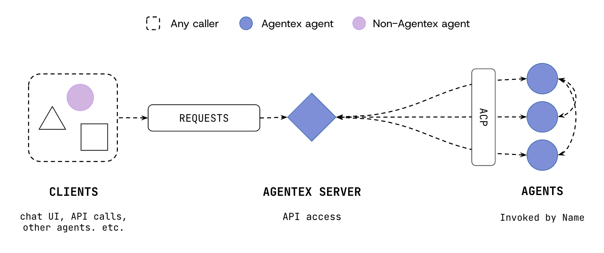

# Agentex Overview

Understanding how Agentex works will help you make better decisions when building and deploying agents.



## A Helpful Analogy (Formula 1)

Think of Agentex like Formula 1 racing. As an **agent developer**, you're like an F1 team. You want to build the fastest possible car—that's your **agent** (on the right). But no team wants to build the track. You just need a high-performance foundation to race on.

The **Agentex Server** (in the center) is that track. The **dotted lines** in the diagram demonstrate how the track connects everything—all agents are on the same track, so they can race together and be invoked the same way. Agentex handles all the routing, async execution, and infrastructure that keeps agents reliable at scale.

Because of Agentex, agent developers don't have to (and shouldn't) spend time thinking about communication, streaming, credential management, deployment, hosting, or how to move from simple sync agents (L1-L3) to complex async agents (L4+).

**Clients** (on the left)—like chat UIs, API callers, or other systems—are the entities that trigger your agents to perform. They send requests through our unified API. The **ACP** (Agent-to-Client Protocol) is the standardized interface we implemented to ensures every agent communicates the same way, regardless of how it's built internally.

And just like F1 doesn't dictate how teams build their cars, Agentex doesn't dictate how you build agents. Use Scale's SDKs, MCP, OpenAI Agents, LangChain, or any tools you choose. Agentex doesn't replace your tools—it connects them.

The result: you focus on your business logic while Agentex handles everything else.


## How Agentex Works

In Agentex, agents are "just code". In production, we package up this code as docker images and deploy these agents on Kubernetes using Helm charts (more on this later).

To allow for complete code flexibility, but also make it easy to invoke all agents the same way, we abstract code written by agent developers behind standard entrypoints. We call this abstraction "Agent-to-Client Protocol" (ACP).

Here is an example of how simple this makes it for Agent developers to write arbitrary code behind a standard entrypoint. Here is a Sync Agent's ACP definition:

```python
acp = FastACP.create(acp_type="sync")

@acp.on_message_send
async def handle_message_send(params: SendMessageParams) -> Union[TaskMessageContent, list[TaskMessageContent], AsyncGenerator[TaskMessageUpdate, None]]:
    # Write arbitrary agent logic here
    pass
```

The developer just needs to implement this function; calling upon any SDK or resources they'd like and returning the type hinted response shapes. The Agentex server handles data persistence and sending messages back to the client so you don't have to, just focus on your internal logic.

This allows all agent callers (web UIs, APIs, other agents, etc.) to call any Agentex agent the exact same way. Callers only need to know these 3 things:

- **Request payload** (standardized by the ACP)
- **API route** (domain of the hosted Agentex Server)
- **The name or ID** of the Agent to call

If you're developing a frontend, we recommend you start with our open source **[Agentex UI](https://github.com/scaleapi/scale-agentex/tree/main/agentex-ui)**. It takes care of the message sending above across all different types of Agents. It also handles stream aggregation logic, and a bunch of other complexity that makes it hard to "get off the ground" with most agent libraries.

### Message Flow


## Components

Agentex provides three key components, each with their own open source package:

| Component | Description | Source |
|-----------|-------------|--------|
| **Agentic Infrastructure** | Production platform for running agents at scale<br><br>• **Agent-to-Client Protocol (ACP)** - Standardized communication<br>• **Asynchronous Architecture** - Sync and async execution<br>• **Real-Time Streaming** - Updates to clients<br>• **Scalable Deployments** - Independent service scaling | [scaleapi/scale-agentex/agentex](https://github.com/scaleapi/scale-agentex/tree/main/agentex){target="_blank"} |
| **Agentex Python SDK** | Developer toolkit for building agents locally<br><br>• **FastACP** - Define handlers with decorators to serve agent code via FastAPI.<br>• **SDK** - Tools for agent-builders to handle messages, state, tasks, streaming, etc.<br>• **CLI** - Local development and deployment tools | [scaleapi/scale-agentex-python](https://github.com/scaleapi/scale-agentex-python){target="_blank"} |
| **Agentex UI** | Frontend components for chat interfaces<br><br>• **Agentex UI Kit** - React components for customer apps<br>• **Agentex Web** - Hosted UI for local development and demos | [scaleapi/scale-agentex/agentex-ui](https://github.com/scaleapi/scale-agentex/tree/main/agentex-ui){target="_blank"} |


## Design Principles

### For Developers

We believe the most advanced applications are made code-first. With AI advancements increasingly accessible via SDKs, Agentex prioritizes developer flexibility and rapid iteration without sacrificing capability.

1. **Agents are just code** - Build with complete code flexibility using any programming patterns
2. **Code is unopinionated and usable with any library** - Use Scale's SDKs, MCP, OpenAI Agents, LangChain, or any tools you choose
3. **Local development is fast and easy** - Iterate quickly without complex setup or infrastructure
4. **Both simple sync and complex async use cases are supported** - From basic chatbots (L1-L3) to advanced autonomous agents (L4+)
5. **All agents can be called with a unified communication protocol** - Standardized ACP ensures consistent invocation across all agent types

### For Customers

Hybrid development creates win-win opportunities for Scale and our partners. Enterprises need the path of least resistance to AI-ify their companies as rapidly as possible. Agentex enables this by opening doors—providing production-grade infrastructure that teams can own and operate independently, rather than creating dependencies on Scale as the sole-developers of enterprise AI.

1. **Deployment process must be acceptable for every enterprise** - Production-grade deployment with Kubernetes and Helm charts
2. **Agents are modifiable by customers without Scale assistance** - Full code ownership and customization
3. **Agentic Infrastructure can be used self-service without Scale assistance** - Open-source and independently deployable
4. **Agentic Infrastructure is well-documented and easy to use for the public** - Comprehensive documentation and examples
