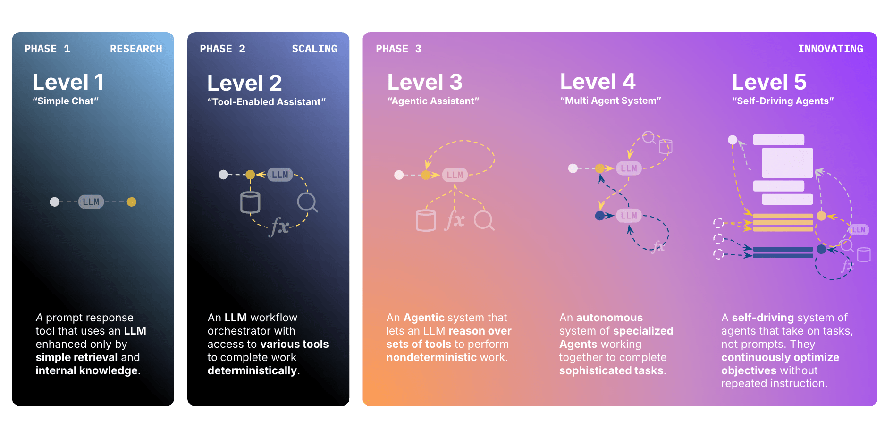

# Introduction to Agentex

AI agent capabilities can be understood in five levels, from simple chatbots to fully autonomous, self-driving agentic systems:

Today, most AI applications are limited to Level 3 (L3) and below, relying on synchronous request/response patterns. This restricts their ability to handle complex, long-running, or autonomous workflows.

**Agentex** is designed to be future-proof, enabling you to build, deploy, and scale agents at any level (L1–L5). As your needs grow, you can seamlessly progress from basic to advanced agentic AI—without changing your core architecture.

!!! note "Agentex is for all levels of AI agents"
    While Agentex is built to support advanced L4+ agents, it natively supports L1–L3 agents and simple request/response agents as well. You can start with basic conversational or task-based AI and seamlessly progress to fully autonomous, distributed, and asynchronous agents—all on the same platform. Agentex is future-proofed for a world where AI will be distributed across all levels.

## Quick Start

Follow our [Getting Started Guide on GitHub](https://github.com/scaleapi/scale-agentex#getting-started){target="_blank"} to set up your environment and create your first agent.

The GitHub README will you how to scaffold an L1 example just to learn the ropes. These Docs are meant to teach you concepts to help you extend all the way to L5 agents. For working code snippets that demonstrate these concepts, refer to the Python SDK. Here is how to use each type of our documentation.

| Resource | Description |
|----------|-------------|
| **[Agentex README](https://github.com/scaleapi/scale-agentex#getting-started)** | **Getting Started**: Spin up a simple agent on your local computer from scratch in minutes. This comes with a full development UI and agent server. |
| **[Python SDK](https://github.com/scaleapi/scale-agentex-python)** | **Examples**: Agent-building tutorials that work out of the box. These show how to build up from simple to more complex agents using Agentex. |
| **[Docs Site](https://agentex.sgp.scale.com/docs)** | **Concepts**: More in depth details on the what, why, and how of building L1-L5 agents.  **Enterprise Support**: Description of how our zero-ops deployment works. Learn how to share hundreds of agents with the rest of your company. Each agent is hosted and scaled independently on cloud-agnostic infrastructure. |

