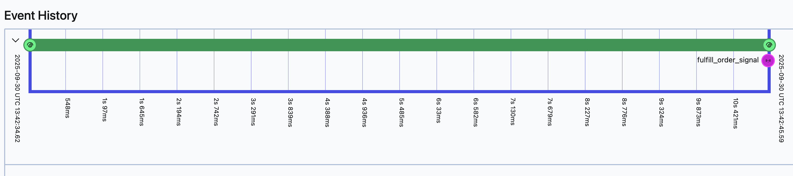

# Human-in-the-Loop Pattern

Enable agents to wait indefinitely for human approval without losing context, using Temporal signals and child workflows.

## Why Human-in-the-Loop?

Agents often need human approval before taking high-stakes actions like financial transactions, legal document signing, or compliance-sensitive decisions. Traditional approaches fail because waiting blocks the agent, system crashes lose context, and interrupted workflows can't resume.

**Temporal's signals and child workflows** solve this by enabling agents to wait indefinitely without consuming resources. If the system crashes, the workflow resumes exactly where it left off with full context preserved.


**Without Temporal:**

- Agent blocks resources while waiting for approval
- System crashes lose approval context entirely
- Must restart the entire process after interruption
- Can't handle multi-day approval workflows

**With Temporal:**

- Agent waits without consuming resources
- System crashes don't matter - workflow resumes automatically
- Full context preserved indefinitely (hours, days, or weeks)
- Approval state is durable and survives any failure


## Real-World Applications

**Common approval workflows that benefit from this pattern:**

- **Financial transactions** - Manager approval before wire transfer execution
- **Fraud holds** - Agent pauses suspicious activity, waits for security team review
- **Contract execution** - Legal team signs off before document is finalized
- **Data access** - Compliance approval before granting sensitive information
- **Procurement** - Multi-stage approvals (manager → director → CFO) for large purchases
- **Treatment plans** - Doctor authorization before prescription fulfillment

---

## The Pattern

### Step 1: Create the Confirmation Tool

The key technique here is using **child workflows** - independent workflows spawned by a parent that inherit all of Temporal's durability guarantees. This allows the approval process to run as a separate, long-running workflow that can wait indefinitely without blocking the parent.

Use child workflows when you need long-running sub-processes like approvals, parallel operations, or any workflow that needs to outlive a single operation. [Learn more about Temporal child workflows](https://docs.temporal.io/develop/python/child-workflows).

```python
# tools.py
from agents import function_tool
from temporalio import workflow
from temporalio.workflow import ParentClosePolicy
from project.child_workflow import ApprovalWorkflow
from agentex.lib.environment_variables import EnvironmentVariables

environment_variables = EnvironmentVariables.refresh()

@function_tool
async def wait_for_confirmation(action: str) -> str:
    """Wait for human approval before proceeding"""

    result = await workflow.execute_child_workflow(
        ApprovalWorkflow.run,
        environment_variables.WORKFLOW_NAME + "_approval",
        id=f"approval-{workflow.uuid4()}",
        parent_close_policy=ParentClosePolicy.TERMINATE,
    )

    return result
```

### Step 2: Create Child Workflow for Approval

The child workflow uses **signals** - a Temporal technique that lets external systems send messages to running workflows. Think of signals as secure, durable event triggers that can wake up a waiting workflow from anywhere (CLI, API, webhook, etc.).

Use signals when you need external systems to communicate with long-running workflows, like user approvals, webhook notifications, or live data feeds. [Learn more about Temporal signals](https://docs.temporal.io/develop/python/message-passing#send-signal-from-client).

```python
# child_workflow.py
import asyncio
from temporalio import workflow
from agentex.lib.utils.logging import make_logger
from agentex.lib.environment_variables import EnvironmentVariables

environment_variables = EnvironmentVariables.refresh()
logger = make_logger(__name__)

@workflow.defn(name=environment_variables.WORKFLOW_NAME + "_approval")
class ApprovalWorkflow:
    def __init__(self):
        self._approval_queue: asyncio.Queue[bool] = asyncio.Queue()

    @workflow.run
    async def run(self, action: str) -> str:
        logger.info(f"Waiting for approval: {action}")

        # Wait until signal received
        await workflow.wait_condition(
            lambda: not self._approval_queue.empty()
        )

        # Approval received
        approved = await self._approval_queue.get()
        return "Approved" if approved else "Rejected"

    @workflow.signal
    async def approve(self, approved: bool) -> None:
        """Signal to approve or reject"""
        await self._approval_queue.put(approved)
```

### Step 3: Use in Your Agent

```python
# workflow.py
from agents import Agent, Runner
from project.tools import wait_for_confirmation

approval_agent = Agent(
    name="Approval Agent",
    instructions="When asked to perform an action, use wait_for_confirmation to get human approval first.",
    tools=[wait_for_confirmation],
)

result = await Runner.run(approval_agent, params.event.content.content)
```

### Step 4: Trigger Approval

Send the signal when human approves:

```bash
# Via Temporal CLI
temporal workflow signal \
  --workflow-id="approval-workflow-id" \
  --name="approve" \
  --input=true
```

Or programmatically:

```python
# Via Temporal client
from temporalio.client import Client

client = await Client.connect("localhost:7233")
handle = client.get_workflow_handle("approval-workflow-id")
await handle.signal("approve", True)
```

---

## Why This Works

### Durable Waiting

**Without Temporal:**

- Agent blocks resources while waiting
- If system crashes, approval context is lost
- Have to restart the entire process

**With Temporal:**

- Agent waits without consuming resources
- System crashes don't matter - workflow resumes
- Full context preserved indefinitely
- Can wait hours, days, or weeks

### Workflow Visualization

**Parent workflow spawns child for approval:**


The parent workflow waits for the child to complete, which happens when the signal is received.

**Child workflow waits for signal:**



The child workflow runs until the `approve` signal is triggered, then completes.


