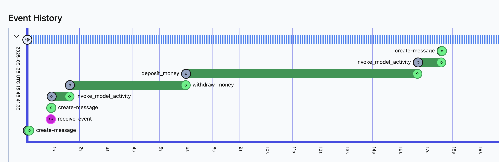

# OpenAI Agents SDK + Temporal Integration

Learn how to integrate the OpenAI Agents SDK with Temporal workflows in Agentex to build durable, production-grade agents.

!!! note "Temporal Required"
    The OpenAI Agents SDK integration is **only available with Temporal ACP**. This integration uses Temporal's durability features to make OpenAI SDK calls reliable.

## What You'll Learn

- How to set up the OpenAI Agents SDK plugin with Temporal
- How to enable **real-time streaming** using interceptors and context variables
- How to create agents that automatically benefit from Temporal's durability
- How to add tools that execute as Temporal activities
- How to use **lifecycle hooks** for complete UI visibility
- How Temporal provides observability through the Temporal UI

## Why OpenAI SDK + Temporal?

**OpenAI Agents SDK** makes building agents simple - focus on what your agent does, not the infrastructure.

**Temporal** provides durability and fault tolerance - agents survive failures and resume exactly where they left off.

**Together:** You get simple agent development with production-grade reliability. LLM calls, tool executions, and state are all automatically durable.

### The Value

**Without Temporal + Streaming:**
- Agent crashes = lost context and state
- Users wait 10-30 seconds for complete responses
- No visibility into agent's thinking process

**With Temporal + Streaming:**
- Agent resumes exactly where it stopped, maintaining full conversation context and state
- Users see tokens as they're generated in real-time
- Complete visibility into tool calls, reasoning, and agent actions
- Production-grade reliability with automatic retries

**Key Innovation:** Using Temporal's interceptor pattern, we achieve real-time streaming without forking any components - the standard OpenAI Agents plugin works seamlessly with streaming!

**Learn more:** [OpenAI Agents SDK](https://openai.github.io/openai-agents-python/) | [Temporal Python](https://docs.temporal.io/develop/python)

---

## Setup & Configuration

### Prerequisites

```bash
# Create a new Temporal agent
agentex init

# Choose 'temporal' when prompted
# Navigate to your project
cd your-project-name
```

### Add the OpenAI Plugin with Streaming Support

**Configure Worker (`run_worker.py`) with Streaming:**

```python
from temporalio.contrib.openai_agents import OpenAIAgentsPlugin
from agentex.lib.core.temporal.workers.worker import AgentexWorker
from agentex.lib.core.temporal.plugins.openai_agents.interceptors.context_interceptor import ContextInterceptor
from agentex.lib.core.temporal.plugins.openai_agents.models.temporal_streaming_model import TemporalStreamingModelProvider

acp = FastACP.create(
    acp_type="async",
    config=TemporalACPConfig(
        type="temporal",
        temporal_address=os.getenv("TEMPORAL_ADDRESS", "localhost:7233"),
        plugins=[OpenAIAgentsPlugin()]  # Add the plugin
    )
)

# ============================================================================
# STREAMING SETUP: Interceptor + Model Provider
# ============================================================================
# Two key components enable real-time streaming while maintaining Temporal durability:
#
# 1. ContextInterceptor
#    - Threads task_id through activity headers using Temporal's interceptor pattern
#    - Outbound: Reads _task_id from workflow instance, injects into activity headers
#    - Inbound: Extracts task_id from headers, sets streaming_task_id ContextVar
#    - Enables runtime context without forking the Temporal plugin!
#
# 2. TemporalStreamingModelProvider
#    - Returns StreamingModel instances that read task_id from ContextVar
#    - StreamingModel.get_response() streams tokens to Redis in real-time
#    - Still returns complete response to Temporal for determinism/replay safety
#    - Uses AgentEx ADK streaming infrastructure (Redis XADD to stream:{task_id})
#
# Together, these enable real-time LLM streaming while maintaining Temporal's
# durability guarantees. No forked components - uses STANDARD OpenAIAgentsPlugin!

context_interceptor = ContextInterceptor()
temporal_streaming_model_provider = TemporalStreamingModelProvider()

# IMPORTANT: We use the STANDARD temporalio.contrib.openai_agents.OpenAIAgentsPlugin
# No forking needed! The interceptor + model provider handle all streaming logic.
worker = AgentexWorker(
    task_queue=task_queue_name,
    plugins=[OpenAIAgentsPlugin(model_provider=temporal_streaming_model_provider)],
    interceptors=[context_interceptor]
)
```

**3. Add OpenAI API Key:**

```yaml
# In manifest.yaml
agent:
  credentials:
    - env_var_name: "OPENAI_API_KEY"
      secret_name: "openai-secret"
      secret_key: "api-key"
```

That's it! The plugin automatically handles activity creation for all OpenAI SDK calls.

---

## How Streaming Works: Interceptors + Context Variables

The new streaming implementation uses Temporal's interceptor pattern to enable real-time token streaming while maintaining workflow determinism. Here's how task_id flows through the system:

### Key Benefits

**No Forked Components**: Uses the standard `temporalio.contrib.openai_agents.OpenAIAgentsPlugin` - no need to maintain custom plugin versions.

**Temporal Durability**: Complete responses are still returned to Temporal for determinism and replay safety.

**Real-Time Streaming**: Users see tokens as they're generated via Redis streams.

**Clean Architecture**: Interceptors are Temporal's official extension mechanism - clear separation between streaming logic and core plugin.

---

## Hello World Example

### Basic Agent Response

```python
# workflow.py
from agents import Agent, Runner
from agentex import adk
from agentex.lib.types.acp import SendEventParams
from agentex.lib.core.temporal.types.workflow import SignalName
from agentex.types.text_content import TextContent
from temporalio import workflow

@workflow.defn
class ExampleWorkflow:
    def __init__(self):
        self._task_id = None
        self._trace_id = None
        self._parent_span_id = None

    @workflow.signal(name=SignalName.RECEIVE_EVENT)
    async def on_task_event_send(self, params: SendEventParams) -> None:
        # Echo user message
        await adk.messages.create(task_id=params.task.id, content=params.event.content)

        # Create OpenAI agent
        agent = Agent(
            name="Haiku Assistant",
            instructions="You are a friendly assistant who always responds in the form of a haiku.",
        )

        # ============================================================================
        # STREAMING SETUP: Store task_id for the Interceptor
        # ============================================================================
        # These instance variables are read by StreamingWorkflowOutboundInterceptor
        # which injects them into activity headers. This enables streaming without
        # forking the Temporal plugin!
        #
        # How it works:
        # 1. We store task_id in workflow instance variable (here)
        # 2. StreamingWorkflowOutboundInterceptor reads it via workflow.instance()
        # 3. Interceptor injects task_id into activity headers
        # 4. StreamingActivityInboundInterceptor extracts from headers
        # 5. Sets streaming_task_id ContextVar inside the activity
        # 6. StreamingModel reads from ContextVar and streams to Redis
        self._task_id = params.task.id
        self._trace_id = params.task.id
        self._parent_span_id = params.task.id

        # Run the agent - no need to wrap in activity!
        # The interceptor handles task_id threading automatically
        result = await Runner.run(agent, params.event.content.content)

        # Send response
        await adk.messages.create(
            task_id=params.task.id,
            content=TextContent(
                author="agent",
                content=result.final_output,
            ),
        )
```

### Why No Activity Wrapper?

The OpenAI SDK plugin automatically wraps `Runner.run()` calls in Temporal activities. You get durability without manual activity creation!

### Lifecycle Hooks: Streaming Beyond LLM Responses

#### What Hooks Stream

The `TemporalStreamingModelProvider` automatically handles streaming **LLM responses** (text tokens and reasoning tokens from thinking models like o1).

**Hooks handle everything else** - they stream agent lifecycle events to the UI:

| Event | What It Captures | When to Use |
|-------|------------------|-------------|
| `on_agent_start` | Agent begins execution | Track multi-agent handoffs |
| `on_agent_end` | Agent produces final output | Mark completion |
| `on_tool_start` | Tool called with arguments | Show tool execution in UI |
| `on_tool_end` | Tool returned result | Display tool results in UI |
| `on_handoff` | Agent transfers to another agent | Visualize agent collaboration |
| `on_llm_start` | LLM called with prompt | Debug prompts (development) |
| `on_llm_end` | LLM response complete | Debug responses (development) |

**→ Full event reference:** [OpenAI SDK Lifecycle Documentation](https://openai.github.io/openai-agents-python/ref/lifecycle/)

#### When Do I Use Hooks?

**Use hooks to stream non-LLM events** to the UI or logs. The most common use case is **tool call visibility** - showing users when tools execute and what they return.

**Why hooks are useful:**

✅ **Debugging**: Log prompts, tool calls, and agent transitions during development
✅ **UI Visibility**: Stream tool executions to frontend for better UX
✅ **Observability**: Track agent behavior beyond just the final response
✅ **Customization**: Control what events appear in UI vs. what stays hidden

#### Using Default Hooks (Recommended)

Our `TemporalStreamingHooks` class handles tool calls out of the box - **tool requests and responses automatically appear in the UI**:

```python
from agentex.lib.core.temporal.plugins.openai_agents.hooks.hooks import TemporalStreamingHooks

# Create hooks instance with task_id
hooks = TemporalStreamingHooks(task_id=params.task.id)

# Pass hooks to Runner.run() - tool calls now stream to UI automatically
result = await Runner.run(agent, params.event.content.content, hooks=hooks)
```

**Default behavior:**

- `on_tool_start()`: Creates `tool_request` message in database → streams to frontend
- `on_tool_end()`: Creates `tool_response` message in database → streams to frontend
- Frontend automatically renders these as tool call cards (works out of the box!)

#### Customizing Hooks (Advanced)

Inherit from `TemporalStreamingHooks` and override any methods to customize behavior:

```python
from agentex.lib.core.temporal.plugins.openai_agents.hooks.hooks import TemporalStreamingHooks
from agentex import adk
from agentex.types.text_content import TextContent

class CustomHooks(TemporalStreamingHooks):
    """Override specific lifecycle events for custom streaming behavior"""

    async def on_tool_start(self, tool_call):
        """Customize what shows when tool starts"""
        # Example: Hide internal tools, show user-facing ones
        if tool_call.tool_name.startswith("internal_"):
            return  # Skip - don't stream to UI

        # Call parent implementation or create custom message
        await super().on_tool_start(tool_call)

    async def on_agent_start(self, agent, context):
        """Stream agent handoffs to UI"""
        await adk.messages.create(
            task_id=self.task_id,
            content=TextContent(
                author="system",
                content=f"🤖 Agent '{agent.name}' is now active"
            )
        )

    async def on_llm_start(self, context):
        """Log prompts for debugging (don't stream to UI)"""
        # Log to Temporal, not to UI messages
        print(f"LLM prompt: {context.messages}")

# Use your custom hooks
hooks = CustomHooks(task_id=params.task.id)
result = await Runner.run(agent, params.event.content.content, hooks=hooks)
```

**Key Takeaway:**
Hooks provide **flexible streaming** for agent events beyond LLM responses. Use the default class for tool call visibility out of the box, or inherit and override for custom behavior. This gives you fine-grained control over what users see in the UI.

### What You'll See

**Agent Response:**


**Temporal UI - Automatic Activity:**


The `invoke_model_activity` is created automatically by the plugin, providing full observability.

---

## Tools as Activities

Real agents need tools to interact with external systems. There are **two key patterns** for integrating tools with Temporal:

### Pattern 1: Simple External Tools as Activities

Use this pattern when you have a single non-deterministic operation (API call, DB query, etc.).

**Creating a Tool Activity:**

```python
# activities.py
from temporalio import activity

@activity.defn
async def get_weather(city: str) -> str:
    """Get weather for a city (simulates API call)"""
    if city == "New York City":
        return "The weather in New York City is 22 degrees Celsius"
    return "Weather unknown"
```

**Registering the Activity:**

```python
# run_worker.py
from agentex.lib.core.temporal.activities import get_all_activities
from project.activities import get_weather
from agentex.lib.core.temporal.plugins.openai_agents.hooks.activities import stream_lifecycle_content

all_activities = get_all_activities() + [get_weather, stream_lifecycle_content]

await worker.run(
    activities=all_activities,
    workflow=YourWorkflow,
)
```

**Using the Tool with Streaming and Hooks:**

```python
# workflow.py
from agents import Agent, Runner
from temporalio.contrib import openai_agents
from datetime import timedelta
from project.activities import get_weather
from agentex.lib.core.temporal.plugins.openai_agents.hooks.hooks import TemporalStreamingHooks

# Store task_id for streaming interceptor
self._task_id = params.task.id
self._trace_id = params.task.id
self._parent_span_id = params.task.id

weather_agent = Agent(
    name="Weather Assistant",
    instructions="Use the get_weather tool to answer weather questions.",
    tools=[
        openai_agents.workflow.activity_as_tool(
            get_weather,
            start_to_close_timeout=timedelta(seconds=10)
        ),
    ],
)

# Create hooks for lifecycle events
hooks = TemporalStreamingHooks(task_id=params.task.id)

# Run agent with hooks - streaming happens automatically via interceptor
result = await Runner.run(weather_agent, params.event.content.content, hooks=hooks)
```

### Pattern 2: Multiple Activities Within Tools

Use this pattern when you need multiple sequential operations that must complete together - like transferring money (withdraw + deposit) or processing an order (validate + charge + ship).

**The Challenge:** Relying on the LLM to make separate tool calls is unreliable:
- LLM might only call withdraw, never deposit (money lost!)
- No guarantee of execution order
- Can't recover from partial completion

**The Solution:** Create one tool with multiple activities executed sequentially with guaranteed ordering.

**Creating Activity Functions:**

```python
# activities.py
from temporalio import activity
import asyncio

@activity.defn
async def withdraw_money(from_account: str, amount: float) -> str:
    """Withdraw money from an account"""
    # Simulates API call (in production: actual banking API)
    await asyncio.sleep(5)
    print(f"Withdrew ${amount} from {from_account}")
    return f"Successfully withdrew ${amount} from {from_account}"

@activity.defn
async def deposit_money(to_account: str, amount: float) -> str:
    """Deposit money into an account"""
    # Simulates API call (in production: actual banking API)
    await asyncio.sleep(10)
    print(f"Deposited ${amount} into {to_account}")
    return f"Successfully deposited ${amount} into {to_account}"
```

**Register Activities:**

```python
# run_worker.py
from agentex.lib.core.temporal.activities import get_all_activities
from project.activities import withdraw_money, deposit_money

all_activities = get_all_activities() + [withdraw_money, deposit_money]

await worker.run(
    activities=all_activities,
    workflow=YourWorkflow,
)
```

**Creating the Composite Tool:**

```python
# tools.py
from agents import function_tool
from temporalio import workflow
from datetime import timedelta

@function_tool
async def move_money(from_account: str, to_account: str, amount: float) -> str:
    """Move money from one account to another atomically"""

    # STEP 1: Start the withdrawal activity
    # This creates a Temporal activity that will be retried if it fails
    withdraw_result = await workflow.execute_activity(
        withdraw_money,
        args=[from_account, amount],
        start_to_close_timeout=timedelta(days=1)  # Long timeout for banking operations
    )

    # STEP 2: Only after successful withdrawal, start the deposit activity
    # This guarantees the sequence: withdraw THEN deposit
    deposit_result = await workflow.execute_activity(
        deposit_money,
        args=[to_account, amount],
        start_to_close_timeout=timedelta(days=1)
    )

    # PATTERN 2 BENEFIT: From the agent's perspective, this was ONE tool call
    # But in Temporal UI, you'll see TWO activities executed in sequence
    # Each activity gets its own retry logic and durability guarantees
    return f"Successfully moved ${amount} from {from_account} to {to_account}"
```

**Using the Composite Tool:**

```python
# workflow.py
from agents import Agent, Runner
from project.tools import move_money
from agentex.lib.core.temporal.plugins.openai_agents.hooks.hooks import TemporalStreamingHooks

money_agent = Agent(
    name="Money Transfer Agent",
    instructions="Use the move_money tool to transfer funds between accounts.",
    tools=[move_money],
)

# Store task_id for streaming
self._task_id = params.task.id

# Create hooks
hooks = TemporalStreamingHooks(task_id=params.task.id)

# Run agent - this will create TWO activities when move_money is called
result = await Runner.run(money_agent, params.event.content.content, hooks=hooks)
```

**Why This Works - Guaranteed Sequential Execution:**

```
1. LLM decides to call move_money tool
2. Activity: withdraw_money executes
   → If fails: Temporal retries automatically
   → If succeeds: Proceeds to next step
3. Activity: deposit_money executes
   → If fails: Temporal retries automatically
   → Withdraw already completed (durable state)
4. Tool returns success
5. LLM continues with confirmation
```

**Transactional Guarantees:**
- **Atomic operations**: Both complete or workflow handles partial state
- **Exact resumption**: If system crashes, resumes at exact activity
- **No lost updates**: Temporal's event sourcing ensures no data loss
- **Automatic retries**: Failed activities retry without manual intervention

**When to Use Pattern 2:**

✅ **Use when:**
- Multiple external API calls must complete together
- Order of operations matters
- Partial completion is dangerous (e.g., money withdrawn but not deposited)
- Need guaranteed execution with retries
- Operations can take minutes/hours to complete

❌ **Don't use when:**
- Single operation is sufficient (use Pattern 1 instead)
- Operations are independent (use separate tools)
- Operations are deterministic (no need for activities)

**Real-World Applications:**

**Financial Operations:**
- Transfer money (withdraw + deposit)
- Process payment (authorize + capture)
- Refund transaction (cancel charge + return funds)

**E-Commerce:**
- Process order (validate + charge + create shipment)
- Cancel order (refund + cancel shipment + update inventory)

**Data Processing:**
- ETL pipeline (extract + transform + load)
- Multi-stage analysis (fetch + process + store)

**What You'll See:**


The agent successfully transfers money with full context.



Temporal UI shows both activities, execution times, and parameters - full observability into the transactional operation.

### Pattern Comparison

| Pattern 1 (activity_as_tool) | Pattern 2 (function_tool) |
|-------------------------------|---------------------------|
| Single activity per tool call | Multiple activities per tool call |
| 1:1 tool to activity mapping | 1:many tool to activity mapping |
| Simple non-deterministic ops | Complex multi-step operations |
| Let LLM sequence multiple tools | Code controls activity sequencing |
| Example: get_weather, db_lookup | Example: money_transfer, multi_step_workflow |

**Both patterns provide:**
- Automatic retries and failure recovery
- Full observability in Temporal UI
- Durable execution guarantees
- Real-time streaming via interceptors
- Lifecycle hooks for UI messages

### Results

**Agent uses the tool:**


**Temporal UI shows tool execution:**


The model invokes the tool, the tool executes as an activity, then the model is called again with the result. All steps are durable.

---

## Advanced Patterns

### Human-in-the-Loop
When agents need human approval before taking action:

**→ See [Human-in-the-Loop Pattern](human_in_the_loop.md)**

Learn how to use signals and child workflows for approval workflows that survive system failures.

---

## Complete Examples

**Full working examples on GitHub:**
- [Hello World](https://github.com/scaleapi/scale-agentex-python/tree/main/examples/tutorials/10_async/010_temporal/060_open_ai_agents_sdk_hello_world)
- [Tools Integration](https://github.com/scaleapi/scale-agentex-python/tree/main/examples/tutorials/10_async/010_temporal/070_open_ai_agents_sdk_tools)
- [Human-in-the-Loop](https://github.com/scaleapi/scale-agentex-python/tree/main/examples/tutorials/10_async/010_temporal/080_open_ai_agents_sdk_human_in_the_loop)

