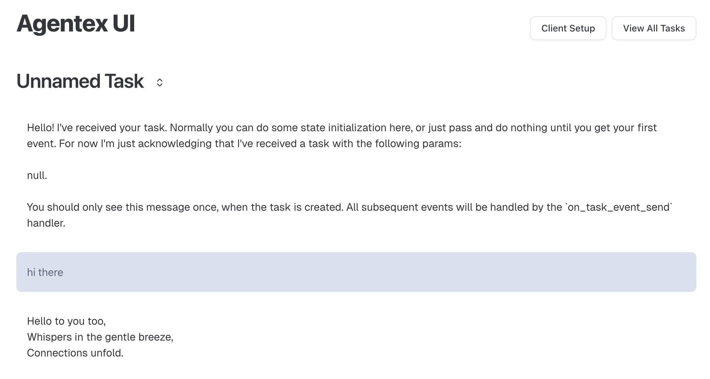
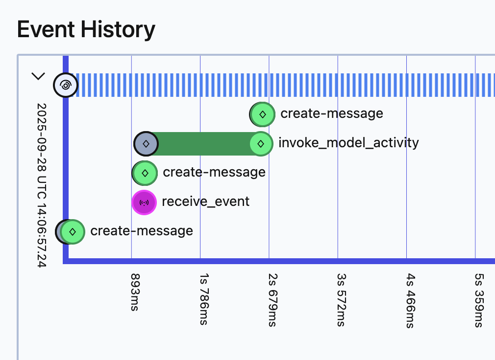
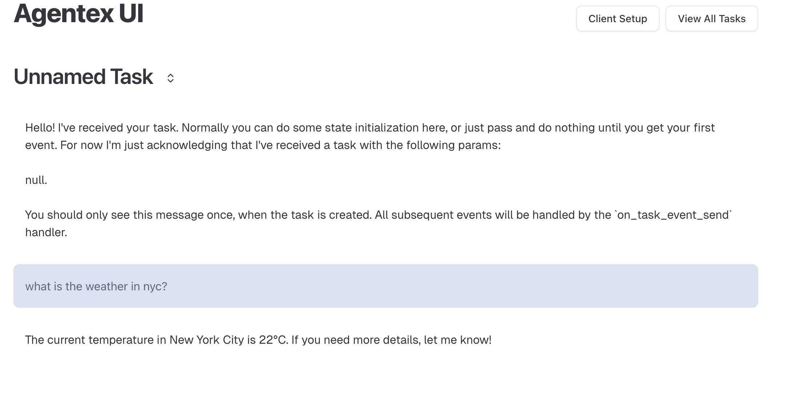
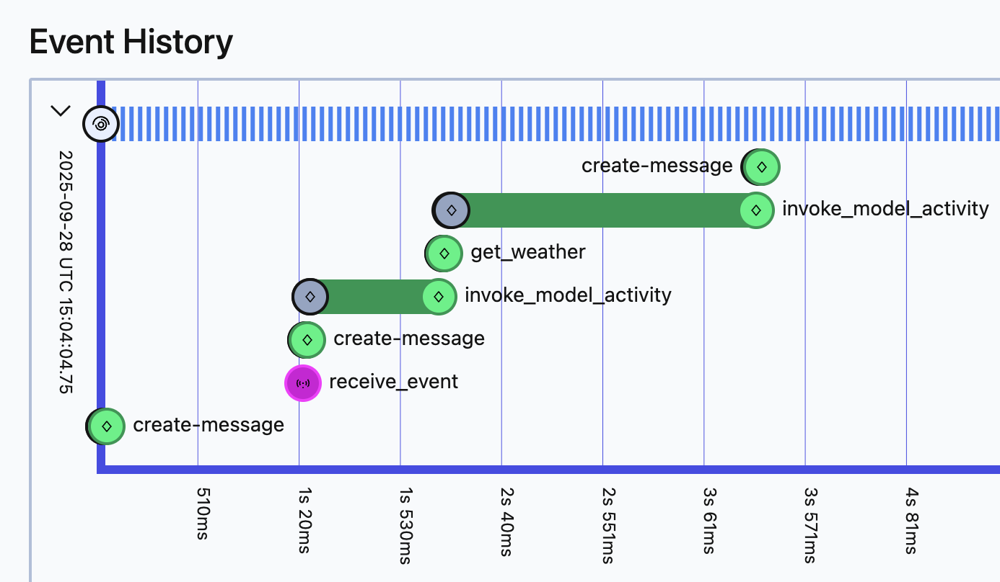

# OpenAI Agents SDK + Temporal Integration

Learn how to integrate the OpenAI Agents SDK with Temporal workflows in Agentex to build durable, production-grade agents.

!!! note "Temporal Required"
    The OpenAI Agents SDK integration is **only available with Temporal ACP**. This integration uses Temporal's durability features to make OpenAI SDK calls reliable.

## What You'll Learn

- How to set up the OpenAI Agents SDK plugin with Temporal
- How to create agents that automatically benefit from Temporal's durability
- How to add tools that execute as Temporal activities
- How Temporal provides observability through the Temporal UI

## Why OpenAI SDK + Temporal?

**OpenAI Agents SDK** makes building agents simple - focus on what your agent does, not the infrastructure.

**Temporal** provides durability and fault tolerance - agents survive failures and resume exactly where they left off.

**Together:** You get simple agent development with production-grade reliability. LLM calls, tool executions, and state are all automatically durable.

### The Value

Without Temporal: If your agent crashes mid-conversation, all context is lost.

With Temporal: The agent resumes exactly where it stopped, maintaining full conversation context and state.

**Learn more:** [OpenAI Agents SDK](https://openai.github.io/openai-agents-python/) | [Temporal Python](https://docs.temporal.io/develop/python)

---

## Setup & Configuration

### Prerequisites

```bash
# Create a new Temporal agent
agentex init

# Choose 'temporal' when prompted
# Navigate to your project
cd your-project-name
```

### Add the OpenAI Plugin

**1. Configure ACP (`acp.py`):**

```python
from agentex.lib import FastACP
from agentex.lib.core.temporal.config import TemporalACPConfig
from agentex.lib.plugins.openai_agents import OpenAIAgentsPlugin
import os

acp = FastACP.create(
    acp_type="async",
    config=TemporalACPConfig(
        type="temporal",
        temporal_address=os.getenv("TEMPORAL_ADDRESS", "localhost:7233"),
        plugins=[OpenAIAgentsPlugin()]  # Add the plugin
    )
)
```

**2. Configure Worker (`run_worker.py`):**

```python
from agentex.lib.core.temporal.worker import AgentexWorker
from agentex.lib.plugins.openai_agents import OpenAIAgentsPlugin

worker = AgentexWorker(
    task_queue=task_queue_name,
    plugins=[OpenAIAgentsPlugin()],  # Add the plugin
)
```

**3. Add OpenAI API Key:**

```yaml
# In manifest.yaml
agent:
  credentials:
    - env_var_name: "OPENAI_API_KEY"
      secret_name: "openai-secret"
      secret_key: "api-key"
```

That's it! The plugin automatically handles activity creation for all OpenAI SDK calls.

---

## Hello World Example

### Basic Agent Response

```python
# workflow.py
from agents import Agent, Runner
from agentex import adk
from agentex.lib.types.acp import SendEventParams
from agentex.lib.core.temporal.types.workflow import SignalName
from agentex.types.text_content import TextContent
from temporalio import workflow

@workflow.signal(name=SignalName.RECEIVE_EVENT)
async def on_task_event_send(self, params: SendEventParams) -> None:
    # Echo user message
    await adk.messages.create(task_id=params.task.id, content=params.event.content)

    # Create OpenAI agent
    agent = Agent(
        name="Assistant",
        instructions="You only respond in haikus.",
    )

    # Run the agent - no need to wrap in activity!
    result = await Runner.run(agent, params.event.content.content)

    # Send response
    await adk.messages.create(
        task_id=params.task.id,
        content=TextContent(
            author="agent",
            content=result.final_output,
        ),
    )
```

### Why No Activity Wrapper?

The OpenAI SDK plugin automatically wraps `Runner.run()` calls in Temporal activities. You get durability without manual activity creation!

### What You'll See

**Agent Response:**



**Temporal UI - Automatic Activity:**



The `invoke_model_activity` is created automatically by the plugin, providing full observability.

---

## Tools as Activities

Real agents need tools to interact with external systems. Here's how to add tools that execute as Temporal activities.

### Creating a Tool Activity

```python
# activities.py
from temporalio import activity

@activity.defn
async def get_weather(city: str) -> str:
    """Get weather for a city (simulates API call)"""
    if city == "New York City":
        return "The weather in New York City is 22 degrees Celsius"
    return "Weather unknown"
```

### Registering the Activity

```python
# run_worker.py
from agentex.lib.core.temporal.activities import get_all_activities
from project.activities import get_weather

all_activities = get_all_activities() + [get_weather]

await worker.run(
    activities=all_activities,
    workflow=YourWorkflow,
)
```

### Using the Tool

```python
# workflow.py
from agents.workflow import activity_as_tool
from datetime import timedelta
from project.activities import get_weather

weather_agent = Agent(
    name="Weather Assistant",
    instructions="Use the get_weather tool to answer weather questions.",
    tools=[
        activity_as_tool(
            get_weather,
            start_to_close_timeout=timedelta(seconds=10)
        ),
    ],
)

result = await Runner.run(weather_agent, params.event.content.content)
```

### Results

**Agent uses the tool:**



**Temporal UI shows tool execution:**



The model invokes the tool, the tool executes as an activity, then the model is called again with the result. All steps are durable.

---

## Advanced Patterns

For production scenarios, check out these design patterns:

### Multi-Activity Tools
When a single tool needs multiple sequential operations (e.g., withdraw + deposit for money transfer):

**→ See [Multi-Activity Tools Pattern](../design_patterns/multi_activity_tools.md)**

Learn how to create atomic multi-step tools with transactional guarantees.

### Human-in-the-Loop
When agents need human approval before taking action:

**→ See [Human-in-the-Loop Pattern](../design_patterns/human_in_the_loop.md)**

Learn how to use signals and child workflows for approval workflows that survive system failures.

---

## Complete Examples

**Full working examples on GitHub:**
- [Hello World](https://github.com/scaleapi/scale-agentex-python/tree/main/examples/tutorials/10_agentic/010_temporal/060_open_ai_agents_sdk_hello_world)
- [Tools Integration](https://github.com/scaleapi/scale-agentex-python/tree/main/examples/tutorials/10_agentic/010_temporal/070_open_ai_agents_sdk_tools)
- [Human-in-the-Loop](https://github.com/scaleapi/scale-agentex-python/tree/main/examples/tutorials/10_agentic/010_temporal/080_open_ai_agents_sdk_human_in_the_loop)

