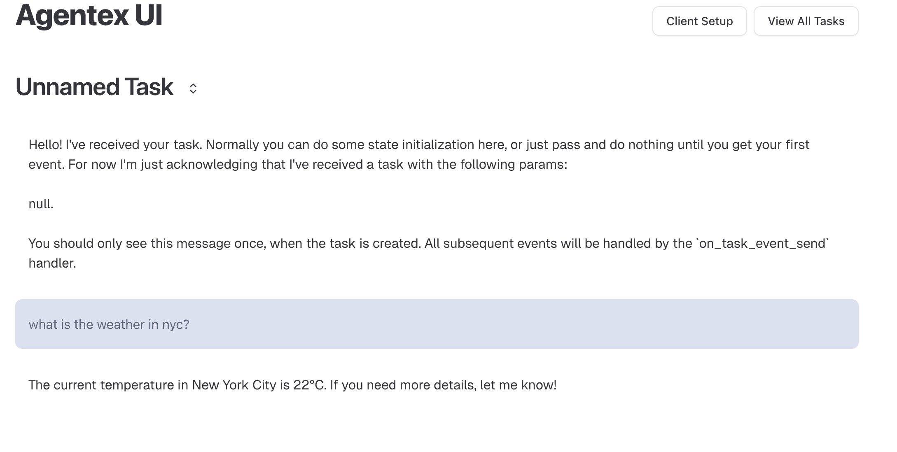

# Tool Design Patterns

Build effective tool integrations with Temporal workflows. This guide covers two key patterns for integrating tools with your agents.

## Prerequisites

Before using these patterns, ensure you have:

- OpenAI SDK plugin configured (see [OpenAI SDK Integration Guide](openai_integration.md))
- Basic understanding of [Temporal workflows](https://docs.temporal.io/develop/python/core-application#develop-workflows) and [activities](https://docs.temporal.io/develop/python/core-application#develop-activities)

---

## Pattern 1: Simple External Tools as Activities

The most straightforward way to give your agent tools is to wrap external operations (like API calls or database queries) as Temporal activities. This pattern uses `activity_as_tool()` to convert a single activity into a tool that the LLM can call.

**Use this pattern when you have a single non-deterministic operation (API call, DB query, etc.).**

This is the simplest and most common pattern - each tool call results in exactly one activity execution. The OpenAI SDK plugin handles all the complexity of invoking activities and passing results back to the LLM.

### Creating a Tool Activity

```python
# activities.py
from temporalio import activity

@activity.defn
async def get_weather(city: str) -> str:
    """Get weather for a city (simulates API call)"""
    if city == "New York City":
        return "The weather in New York City is 22 degrees Celsius"
    return "Weather unknown"
```

**Important:** Activities must be idempotent because Temporal may retry them on failure. This example is safe because weather lookups are read-only. For write operations (payments, database updates), use idempotency keys or check-before-execute patterns to prevent duplicate actions. See [Idempotency Requirements](#idempotency-requirements) for details.

### Registering the Activity

```python
# run_worker.py
from agentex.lib.core.temporal.activities import get_all_activities
from project.activities import get_weather
from agentex.lib.core.temporal.plugins.openai_agents.hooks.activities import stream_lifecycle_content

all_activities = get_all_activities() + [get_weather, stream_lifecycle_content]

await worker.run(
    activities=all_activities,
    workflow=YourWorkflow,
)
```

### Using the Tool with Streaming and Lifecycle Tracking

Two key features make your agent's execution visible in real-time:

**1. Real-time Streaming:** Users see LLM responses token-by-token as they're generated (instead of waiting 10-30 seconds for complete responses). This happens automatically when using the OpenAI Agents SDK plugin - Temporal's interceptors thread the `task_id` from your workflow into activities, enabling streaming to Redis.

**2. Automatic Lifecycle Tracking:** Agentex automatically creates `TaskMessage` records in the database for:
   - Tool calls (tool name, arguments) 
   - Tool responses (results)
   - Agent reasoning steps
   - Final responses

This happens transparently when you use `adk.providers.openai.run_agent_auto_send()` (the "auto send" methods). The UI subscribes to these messages to display what the agent is doing in real-time.

**Why custom infrastructure?** The OpenAI Agents SDK's built-in `Hooks` interface isn't designed for durable systems like Temporal. Their hooks run synchronously in the SDK process, but in Temporal workflows:

- Activities can be retried on different workers
- Workflows need deterministic execution
- State must survive process restarts

So Agentex implements lifecycle tracking at the service layer, creating durable database records that survive retries and failures. This gives you the same visibility as SDK hooks, but with Temporal's durability guarantees.

```python
# workflow.py
from agents import Agent, Runner, activity_as_tool
from datetime import timedelta
from project.activities import get_weather

# Store task_id for streaming interceptor to read
# The interceptor injects this into activity headers, enabling real-time streaming
self._task_id = params.task.id
self._trace_id = params.task.id
self._parent_span_id = params.task.id

weather_agent = Agent(
    name="Weather Assistant",
    instructions="Use the get_weather tool to answer weather questions.",
    tools=[
        activity_as_tool(
            get_weather,
            start_to_close_timeout=timedelta(seconds=10)
        ),
    ],
)

# Run agent - streaming and lifecycle tracking happen automatically!
# No need for manual hooks - Agentex handles it at the service layer
result = await Runner.run(weather_agent, params.event.content.content)
```

**What happens automatically:**

- **Tokens stream to Redis** → UI updates as LLM generates response (via interceptors)
- **Tool calls create TaskMessages** → UI shows "Agent is calling get_weather with city='NYC'"
- **Tool results create TaskMessages** → UI shows "Tool returned: The weather in NYC is 22°C"
- **All durable** → Messages persist in database, visible even after retries/failures

**Note:** If you want manual control over message creation, use `adk.providers.openai.run_agent()` (without `_auto_send`) and create messages yourself with `adk.messages.create()`.

### Results

**Agent uses the tool:**



**Temporal UI shows tool execution:**


The model invokes the tool, the tool executes as an activity, then the model is called again with the result. All steps are durable.

---

## Pattern 2: Multiple Activities Within Tools

For more complex operations that require multiple sequential steps, you can create a single tool that executes multiple activities in a specific order. This pattern uses `@function_tool` to give you full control over activity sequencing within the workflow.

**Use this pattern when you need multiple sequential operations with guaranteed ordering.**

This advanced pattern is essential when the LLM shouldn't control the ordering of operations, or when partial completion would leave your system in an inconsistent state. By grouping multiple activities into a single tool, you ensure sequential execution with visibility into exactly what completed, enabling you to handle partial failures with compensating logic.

### The Problem

You need a tool that performs multiple external operations that must complete together - like transferring money (withdraw + deposit) or processing an order (validate + charge + ship).

**Challenge:** Relying on the LLM to make separate tool calls is unreliable:

- LLM might only call withdraw, never deposit (money lost!)
- No guarantee of execution order
- Can't recover from partial completion

**Solution:** Create one tool with multiple activities executed sequentially.

### Step 1: Create Individual Activities

```python
# activities.py
from temporalio import activity
import asyncio

@activity.defn
async def withdraw_money(from_account: str, amount: float) -> str:
    """Withdraw money from an account"""
    # Simulates API call (in production: actual banking API)
    await asyncio.sleep(5)
    print(f"Withdrew ${amount} from {from_account}")
    return f"Successfully withdrew ${amount} from {from_account}"

@activity.defn
async def deposit_money(to_account: str, amount: float) -> str:
    """Deposit money into an account"""
    # Simulates API call (in production: actual banking API)
    await asyncio.sleep(10)
    print(f"Deposited ${amount} into {to_account}")
    return f"Successfully deposited ${amount} into {to_account}"
```

**Note:** These examples are simplified for demonstration. In production, financial operations must include transaction IDs and idempotency checks to prevent duplicate transfers if Temporal retries the activity. See [Idempotency Requirements](#idempotency-requirements) below.

### Step 2: Register Activities

```python
# run_worker.py
from agentex.lib.core.temporal.activities import get_all_activities
from project.activities import withdraw_money, deposit_money

all_activities = get_all_activities() + [withdraw_money, deposit_money]

await worker.run(
    activities=all_activities,
    workflow=YourWorkflow,
)
```

### Step 3: Create Multi-Activity Tool

```python
# tools.py
from agents import function_tool
from temporalio import workflow
from datetime import timedelta

@function_tool
async def move_money(from_account: str, to_account: str, amount: float) -> str:
    """Move money from one account to another with guaranteed sequential execution"""

    # Step 1: Withdraw money
    withdraw_result = await workflow.start_activity(
        "withdraw_money",
        args=[from_account, amount],
        start_to_close_timeout=timedelta(days=1)
    )

    await withdraw_result

    # Step 2: Deposit money (only happens if withdraw succeeds)
    deposit_result = await workflow.start_activity(
        "deposit_money",
        args=[to_account, amount],
        start_to_close_timeout=timedelta(days=1)
    )

    await deposit_result

    return f"Successfully moved ${amount} from {from_account} to {to_account}"
```

### Step 4: Use the Tool

```python
# workflow.py
from agents import Agent, Runner
from project.tools import move_money

# Store task_id for streaming interceptor
self._task_id = params.task.id
self._trace_id = params.task.id
self._parent_span_id = params.task.id

money_agent = Agent(
    name="Money Transfer Agent",
    instructions="Use the move_money tool to transfer funds between accounts.",
    tools=[move_money],
)

# Run agent - when move_money is called, it creates TWO activities sequentially
# Streaming and lifecycle tracking happen automatically via Agentex infrastructure
result = await Runner.run(money_agent, params.event.content.content)
```

### Why This Works

#### Guaranteed Sequential Execution

```
1. LLM decides to call move_money tool
2. Activity: withdraw_money executes
   → If fails: Temporal retries automatically
   → If succeeds: Proceeds to next step
3. Activity: deposit_money executes
   → If fails: Temporal retries automatically
   → Withdraw already completed (durable state)
4. Tool returns success
5. LLM continues with confirmation
```

#### Execution Guarantees

- **Sequential execution**: Activities execute in order with durable checkpoints between steps
- **Partial state visibility**: If deposit fails after withdraw succeeds, you know exactly what completed and can implement compensating logic (e.g., refund)
- **Exact resumption**: If system crashes, resumes at the exact activity that was running
- **No lost workflow state**: Temporal's event sourcing ensures the complete execution history is preserved
- **Automatic retries**: Failed activities retry based on configured retry policies

**Important:** Temporal does not provide automatic rollback. If `withdraw_money` completes but `deposit_money` fails, the withdrawal has happened and is durable. Your workflow code must implement compensating transactions if rollback behavior is needed.

#### Idempotency Requirements

**Critical:** All activities must be idempotent because Temporal may retry them. An activity is idempotent if calling it multiple times with the same inputs produces the same result without unintended side effects.

**Why this matters:**

- Network failures can cause Temporal to retry an activity that actually succeeded
- Without idempotency, `withdraw_money` could withdraw funds twice
- Use idempotency keys, transaction IDs, or check-before-execute patterns

**Example - Non-idempotent (dangerous):**

```python
@activity.defn
async def withdraw_money(account: str, amount: float) -> str:
    # BAD: Will withdraw twice if retried after network failure
    await bank_api.withdraw(account, amount)
    return f"Withdrew ${amount}"
```

**Example - Idempotent (safe):**

```python
@activity.defn
async def withdraw_money(account: str, amount: float, transaction_id: str) -> str:
    # GOOD: Check if transaction already completed
    if await bank_api.transaction_exists(transaction_id):
        return await bank_api.get_transaction_result(transaction_id)
    
    # Execute with idempotency key
    result = await bank_api.withdraw(account, amount, idempotency_key=transaction_id)
    return result
```

[Learn more about Temporal activity idempotency](https://docs.temporal.io/activities#idempotency)

### What You See in Production


The agent successfully transfers money with full context.


Temporal UI shows both activities, execution times, and parameters - full observability into the transactional operation.
