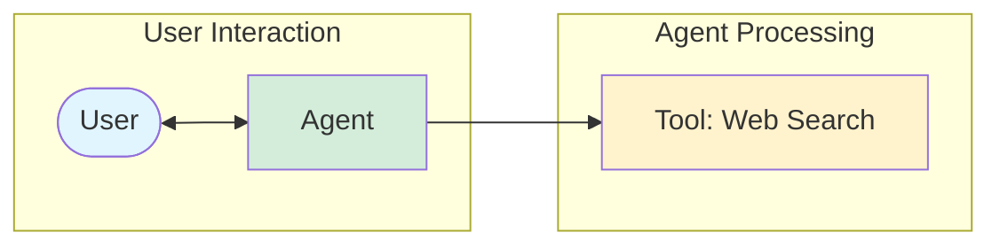
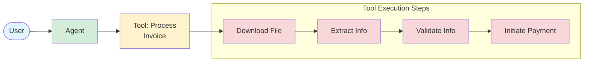
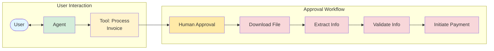
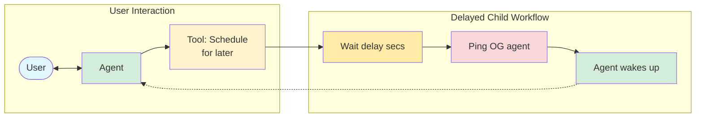
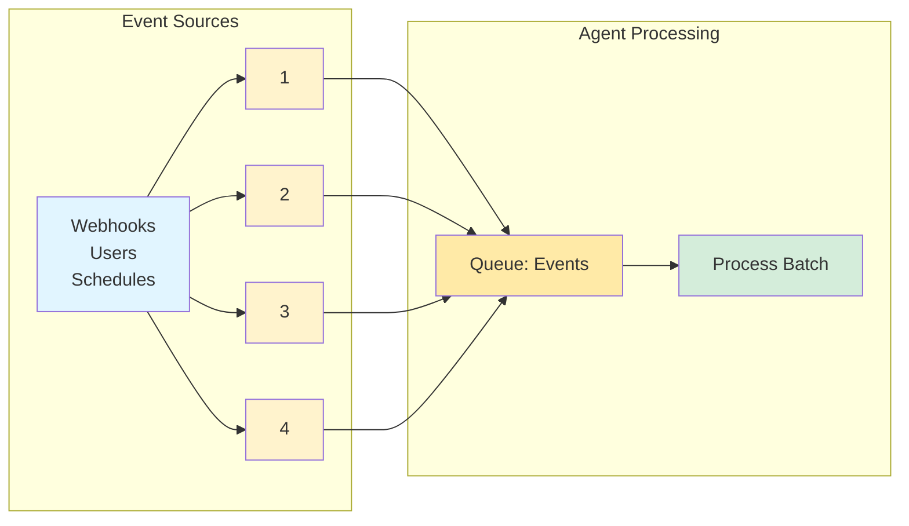
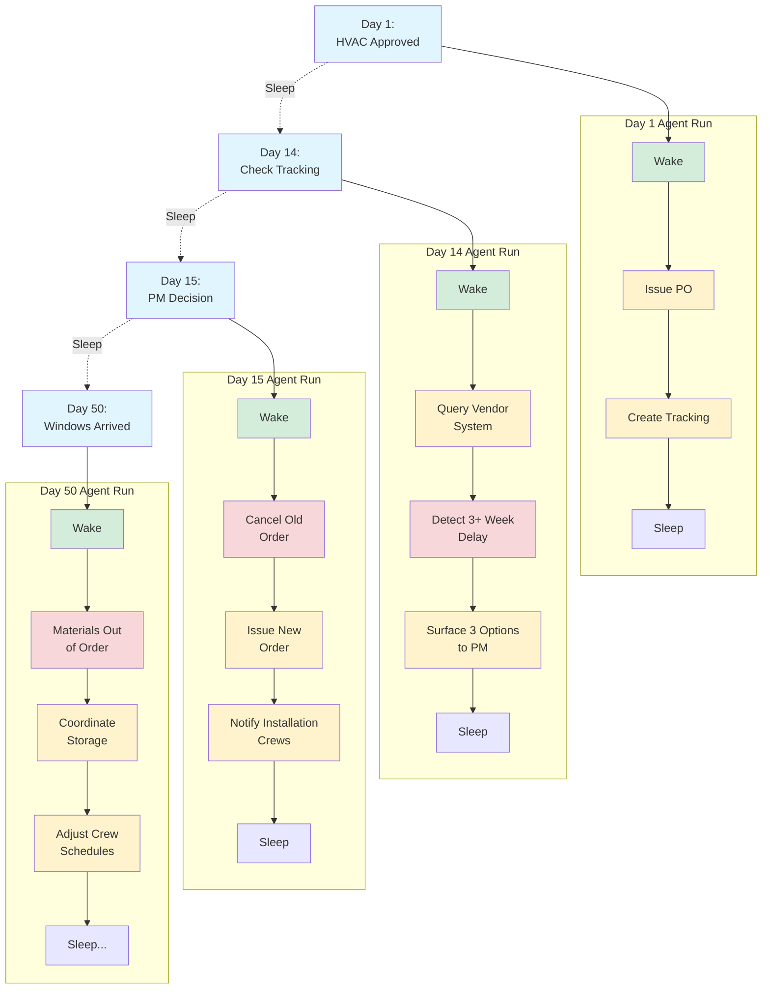

# Agent Development with Temporal

Understanding when Temporal becomes essential—and when it's not necessary—helps you choose the right architecture. Here are six scenarios progressing from simple to complex, showing when you don't need Temporal and when it becomes critical:

## 1. Simple Tools

**Scenario:** Basic agent with a simple web search tool. User asks a question, agent uses the tool, returns result.



**Code Example:**
```python
from agents import Agent, Runner, WebSearchTool

agent = Agent(
    name="Assistant",
    tools=[
        WebSearchTool(),
    ],
)

result = await Runner.run(
    agent,
    "Which coffee shop should I go to, taking into account my preferences and the weather today in SF?"
)
print(result.final_output)
```

**Why Temporal is NOT needed:** For simple single-step tools, **Temporal is not necessary**. Base Agentic ACP or even Sync ACP is sufficient for basic operations that complete quickly and don't require durability. Use Base ACP without Temporal for these cases—it's simpler, faster to develop, and has less operational overhead. Temporal only becomes essential when you need the capabilities shown in the scenarios below.

---

## 2. Durability: Complex Multi-Step Tools

**Scenario:** Invoice processing with multiple sequential steps: Download File → Extract Info → Validate Info → Initiate Payment



**Code Example:**
```python
@function_tool
def process_invoice(file_uri: str) -> str:
    file = workflow.execute_activity(download_file, file_uri)
    vendor_info = workflow.execute_activity(extract, file)
    valid = workflow.execute_activity(validate, vendor_info)
    if valid:
        workflow.execute_activity(pay, vendor_info.vendor)
        return f"Success: payment sent to {vendor_info.vendor}"
    else:
        return "Failure: invalid invoice."
```

**Why Temporal is needed:** Without Temporal, if the "extract" step fails, you'd have to re-download the file. If "validate" fails, you'd have to re-download AND re-extract. **Temporal persists state after each `execute_activity` call**, so failures only retry the failed step. This is critical for expensive operations (file downloads, API calls, payments) where you can't afford to redo work. Temporal also provides automatic retries with backoff policies for transient failures.

---

## 3. Composability: Human-in-the-Loop

**Scenario:** Invoice processing that requires human approval before proceeding with the full workflow.



**Code Example:**
```python
@function_tool
async def process_invoice(file_uri: str) -> str:
    return await workflow.execute_child_workflow(...)

@workflow.defn
class ApproveAndProcessInvoiceWorkflow:
    def __init__(self, approved: bool = False):
        self._approved = approved

    @workflow.signal
    async def on_approval(self, event: ApprovalEvent) -> None:
        self._approved = event.approved

    @workflow.run
    async def run(self, file_uri: str) -> str:
        # re-evaluated when approval signal arrives
        await workflow.wait_condition(lambda: self._approved)
        if self._approved:
            # download, extract, validate, and pay (if valid)
        else:
            return "Failure: invalid invoice."
```

**Why Temporal is needed:** The agent needs to wait for human approval, which could take minutes, hours, or days. **Temporal workflows can pause indefinitely using `wait_condition()` without consuming active resources.** When the human approves (via a signal), the workflow wakes up and continues exactly where it left off. Without Temporal, you'd need to build a complex state machine with polling or webhooks to track where each workflow paused and resume it later. Temporal handles all of this automatically through durable execution and signals.

---

## 4. Autonomous Execution: Scheduled Wake-ups

**Scenario:** Agent schedules a future check (e.g., "check for invoice comments in 3 days"), sleeps, then wakes itself up to continue work.



**Code Example:**
```python
@function_tool
async def check_for_comments(invoice_id: str, delay: int) -> str:
    return await workflow.start_child_workflow(
        DelayedWorkflow, prompt, start_delay=delay
    )

@workflow.defn
class DelayedWorkflow:
    @workflow.run
    async def run(self, invoice_id: str) -> str:
        handle = workflow.get_external_workflow_handle_for(AgentWorkflow)
        await handle.signal(
            AgentWorkflow.on_event,
            Event(prompt=f"Resolve comments for invoice: {invoice_id}")
        )

@workflow.defn
class AgentWorkflow:
    @workflow.signal
    async def on_event(self, event: Event) -> None:
        # Add event.prompt to Agent inputs and move forwards
```

**Why Temporal is needed:** Agents need to schedule future actions without polling. **Temporal child workflows can sleep for arbitrary durations (seconds, days, weeks) using `start_delay`, then signal parent workflows to wake them up.** This enables "check back later" patterns without maintaining active connections or cron jobs. Without Temporal, you'd need external scheduling systems, polling mechanisms, or complex timer infrastructure. Temporal makes time-based orchestration a first-class primitive.

---

## 5. Queueing: Async Batch Processing

**Scenario:** Agent receives events from multiple sources (webhooks, users, schedules) and processes them in batches rather than one-by-one.



**Code Example:**
```python
@workflow.defn
class AgentWorkflow:
    @workflow.init
    def __init__(self, TaskParams):
        self._queue: asyncio.Queue[Event] = asyncio.Queue()
        self._batch_size = BATCH_SIZE

    @workflow.signal
    async def on_event(self, event: Event) -> None:
        self._queue.put(event)

    @workflow.run
    async def run(params: TaskParams):
        # process events as they come in
        while True:
            await workflow.wait_condition(
                lambda: self._queue.qsize() >= self._batch_size,
            )
            current_batch = dequeue_all(self._queue, self._batch_size)
            await workflow.execute_child_workflow(  # blocking
                workflow=ProcessAgentEvents.run,
                args=[current_batch],
            )
```

**Why Temporal is needed:** Processing each event individually is inefficient (API rate limits, batching for analytics, coordinated actions). **Temporal workflows maintain in-memory queues (`asyncio.Queue`) as part of workflow state**, allowing events to accumulate and batch process when thresholds are met. Events received via signals are stored durably in the workflow's event history. Without Temporal, you'd need external queuing systems (Redis, SQS) with complex coordination logic. Temporal makes the queue part of the workflow itself, with automatic persistence and exactly-once processing guarantees.

---

## 6. Long-Running Workflows: Real-World Business Processes

**Scenario:** A 50+ day procurement workflow that wakes and sleeps in response to real-world events:

- **Day 1:** Approve HVAC → Issue PO → Sleep
- **Day 14:** Check tracking → Detect delay → Surface options → Sleep
- **Day 15:** Human cancels → Reorder from alternate → Sleep
- **Day 50:** Windows arrive, steel delayed → Coordinate storage → Sleep



**Why Temporal is needed:** Business processes span arbitrary timeframes (days, weeks, months) with unpredictable events. **Temporal workflows can run indefinitely, waking in response to external signals (webhooks, scheduled checks, human decisions) while maintaining complete state continuity.** The workflow knows it's on Day 50, which vendor was used, what decisions were made on Day 15, and can access the full history. Without Temporal, you'd need to persist all state externally, build resumption logic, handle partial failures, and orchestrate wake-ups manually. Temporal makes long-running, event-driven processes as simple as writing sequential code with signals and wait conditions.

**Key Insight:** Most business-critical processes are long and dynamic. They must adapt to unpredictable, real-world events. Agentex, with its native Temporal integration, gives AI agents the critical capabilities needed to orchestrate complex workflows.
